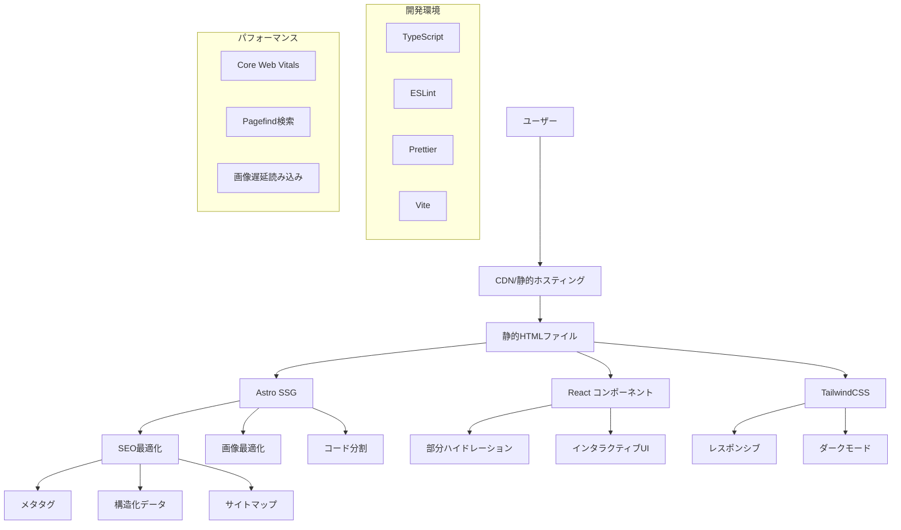
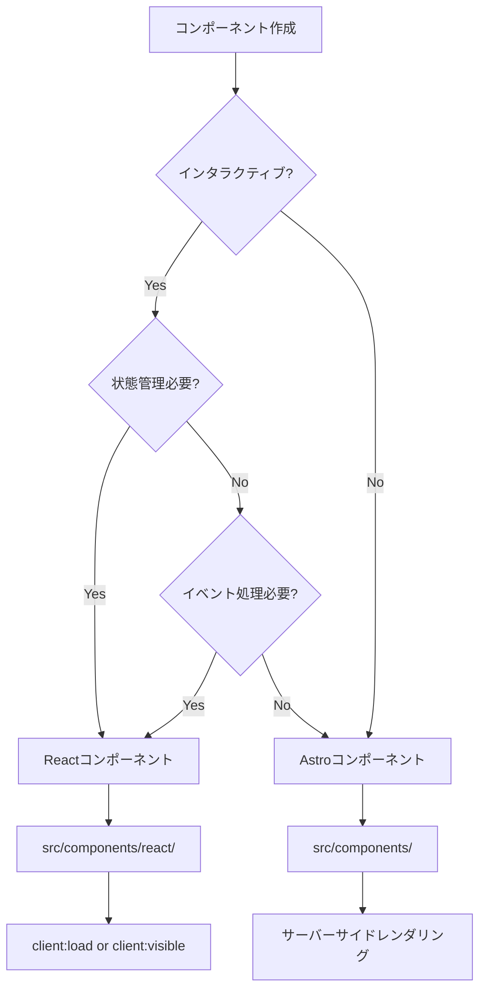

# 詳細設計書 - 非機能要件（NFR）統合版

## 1. 概要

### 1.1 非機能要件一覧
| 要件ID | カテゴリ | 要件名 | 優先度 | 実装状況 |
|-------|---------|--------|--------|---------|
| NFR-001 | パフォーマンス | サイト表示速度 | High | ✅ 完了 |
| NFR-002 | パフォーマンス | SEO対応 | High | 🟡 部分完了 |
| NFR-003 | ユーザビリティ | レスポンシブデザイン | High | ✅ 完了 |
| NFR-004 | ユーザビリティ | アクセシビリティ | Medium | 🟡 部分完了 |
| NFR-005 | 技術要件 | 技術スタック | High | ✅ 完了 |
| NFR-006 | 技術要件 | ハイブリッド構成 | High | ✅ 完了 |
| NFR-007 | 技術要件 | 開発環境 | Medium | ✅ 完了 |
| NFR-008 | 保守性 | コード品質 | High | ✅ 完了 |
| NFR-009 | 保守性 | 拡張性 | Medium | ✅ 完了 |

### 1.2 アーキテクチャ概要図



## 2. NFR-001: サイト表示速度

### 2.1 要件概要
- **目標**: 高速なサイト表示
- **KPI**: 
  - LCP < 2.5秒
  - FID < 100ms
  - CLS < 0.1

### 2.2 実装アーキテクチャ

#### 2.2.1 静的サイト生成（SSG）

**Astro設定**:
```javascript
// astro.config.mjs
export default defineConfig({
  output: 'static',  // 完全静的生成
  build: {
    inlineStylesheets: 'auto',    // 小さなCSSはインライン化
    splitting: true,              // コード分割有効
  },
  compressHTML: true,             // HTML圧縮
  vite: {
    build: {
      minify: 'terser',           // JavaScript最小化
      cssCodeSplit: true,         // CSS分割
      rollupOptions: {
        output: {
          manualChunks: {
            'react-vendor': ['react', 'react-dom'],
            'date-vendor': ['date-fns'],
          }
        }
      }
    }
  }
});
```

**ビルド出力最適化**:
```
dist/
├── _astro/
│   ├── index.[hash].css         # メインCSS（圧縮済み）
│   ├── react-vendor.[hash].js   # React関連ライブラリ
│   └── page.[hash].js           # ページ固有JS
├── index.html                   # 静的HTML
└── blog/
    └── [slug]/
        └── index.html           # 各記事の静的HTML
```

#### 2.2.2 部分ハイドレーション戦略

**コンポーネント別ハイドレーション**:
```astro
<!-- 即座にハイドレーション（UX重要） -->
<Header client:load />
<ThemeToggle client:load />

<!-- 表示時にハイドレーション（パフォーマンス重視） -->
<BlogCard client:visible />
<TableOfContents client:visible />

<!-- 静的レンダリング（ハイドレーション不要） -->
<Footer />
<SearchBox />
```

**JavaScript バンドルサイズ最適化**:
```typescript
// ツリーシェイキング対応
import { format } from 'date-fns/format';          // ❌ 全体インポート
import { format } from 'date-fns';                 // ✅ 必要な関数のみ

// 動的インポート
const LazyComponent = lazy(() => import('./Heavy'));
```

#### 2.2.3 画像最適化

**Astro Image統合**:
```astro
---
import { Image } from 'astro:assets';
---

<!-- 自動最適化 -->
<Image
  src={heroImage}
  alt={title}
  width={800}
  height={400}
  format="webp"
  loading="lazy"
  class="aspect-video object-cover"
/>
```

**レスポンシブ画像**:
```astro
<picture>
  <source
    media="(min-width: 768px)"
    srcset="/images/hero-desktop.webp"
    type="image/webp"
  />
  <source
    media="(max-width: 767px)"
    srcset="/images/hero-mobile.webp"
    type="image/webp"
  />
  
</picture>
```

### 2.3 パフォーマンス監視

**Core Web Vitals測定**:
```javascript
// パフォーマンス測定スクリプト
function measureWebVitals() {
  import('web-vitals').then(({ getCLS, getFID, getLCP }) => {
    getCLS(console.log);  // Cumulative Layout Shift
    getFID(console.log);  // First Input Delay
    getLCP(console.log);  // Largest Contentful Paint
  });
}

if (typeof window !== 'undefined') {
  measureWebVitals();
}
```

## 3. NFR-002: SEO対応

### 3.1 要件概要
- **目標**: 検索エンジン最適化
- **実装状況**: 🟡 部分完了（構造化データ未実装）

### 3.2 メタタグ設計

#### 3.2.1 BaseLayoutでの基本SEO

```astro
---
// src/layouts/BaseLayout.astro
export interface Props {
  title: string;
  description?: string;
  image?: string;
  noindex?: boolean;
  type?: 'website' | 'article';
}

const {
  title,
  description = 'Tech Blogは技術に関する記事や学習記録を共有するブログです。',
  image = '/og-default.jpg',
  noindex = false,
  type = 'website'
} = Astro.props;

const siteTitle = `${title} | Tech Blog`;
const canonicalURL = new URL(Astro.url.pathname, Astro.site);
---

<head>
  <!-- 基本メタタグ -->
  <title>{siteTitle}</title>
  <meta name="description" content={description} />
  <link rel="canonical" href={canonicalURL} />
  
  <!-- robots制御 -->
  {noindex && <meta name="robots" content="noindex, nofollow" />}
  
  <!-- OGP -->
  <meta property="og:type" content={type} />
  <meta property="og:title" content={title} />
  <meta property="og:description" content={description} />
  <meta property="og:image" content={new URL(image, Astro.site)} />
  <meta property="og:url" content={canonicalURL} />
  <meta property="og:site_name" content="Tech Blog" />
  
  <!-- Twitter Card -->
  <meta name="twitter:card" content="summary_large_image" />
  <meta name="twitter:title" content={title} />
  <meta name="twitter:description" content={description} />
  <meta name="twitter:image" content={new URL(image, Astro.site)} />
</head>
```

#### 3.2.2 記事ページ専用SEO

```astro
---
// src/layouts/BlogLayout.astro
const { title, description, pubDate, updatedDate, heroImage, tags } = frontmatter;

const structuredData = {
  "@context": "https://schema.org",
  "@type": "Article",
  "headline": title,
  "description": description,
  "author": {
    "@type": "Person",
    "name": "Tech Blog",
    "url": Astro.site
  },
  "datePublished": pubDate.toISOString(),
  "dateModified": (updatedDate || pubDate).toISOString(),
  "image": heroImage ? new URL(heroImage, Astro.site) : undefined,
  "keywords": tags.join(', '),
  "publisher": {
    "@type": "Organization",
    "name": "Tech Blog",
    "logo": {
      "@type": "ImageObject",
      "url": new URL('/logo.png', Astro.site)
    }
  }
};
---

<BaseLayout
  title={title}
  description={description}
  image={heroImage}
  type="article"
>
  <!-- 構造化データ -->
  <script type="application/ld+json" set:html={JSON.stringify(structuredData)} />
  
  <!-- 記事専用メタタグ -->
  <meta property="article:published_time" content={pubDate.toISOString()} />
  {updatedDate && <meta property="article:modified_time" content={updatedDate.toISOString()} />}
  {tags.map(tag => <meta property="article:tag" content={tag} />)}
</BaseLayout>
```

### 3.3 サイトマップ生成

**自動サイトマップ**:
```javascript
// astro.config.mjs
import { defineConfig } from 'astro/config';
import sitemap from '@astrojs/sitemap';

export default defineConfig({
  site: 'https://yourdomain.com',
  integrations: [
    sitemap({
      changefreq: 'weekly',
      priority: 0.7,
      lastmod: new Date(),
      customPages: [
        'https://yourdomain.com/about',
        'https://yourdomain.com/contact',
      ]
    })
  ]
});
```

## 4. NFR-003: レスポンシブデザイン

### 4.1 要件概要
- **目標**: 全デバイス対応
- **アプローチ**: モバイルファースト

### 4.2 ブレークポイント設計

```javascript
// tailwind.config.mjs
module.exports = {
  theme: {
    screens: {
      'sm': '640px',   // スマートフォン横向き
      'md': '768px',   // タブレット
      'lg': '1024px',  // デスクトップ
      'xl': '1280px',  // 大画面
      '2xl': '1536px', // 超大画面
    }
  }
}
```

### 4.3 コンポーネント別レスポンシブ設計

#### 4.3.1 ヘッダー

```jsx
// src/components/react/Header.tsx
function Header() {
  return (
    <header className="sticky top-0 z-50 bg-white/80 backdrop-blur-md border-b">
      <div className="container mx-auto px-4">
        <div className="flex items-center justify-between h-16">
          {/* ロゴ */}
          <div className="flex-shrink-0">
            <Link href="/" className="text-xl font-bold">
              Tech Blog
            </Link>
          </div>
          
          {/* デスクトップナビゲーション */}
          <nav className="hidden md:block">
            <Navigation currentPath={currentPath} />
          </nav>
          
          {/* モバイルメニューボタン */}
          <div className="md:hidden">
            <MobileMenuButton />
          </div>
        </div>
      </div>
    </header>
  );
}
```

#### 4.3.2 ブログカードグリッド

```astro
<!-- ブログ一覧のレスポンシブグリッド -->
<div class="grid grid-cols-1 sm:grid-cols-2 lg:grid-cols-3 gap-6 lg:gap-8">
  {posts.map(post => (
    <BlogCard post={post} client:visible />
  ))}
</div>
```

### 4.4 タッチ操作対応

```css
/* タッチターゲットサイズ */
.touch-target {
  min-height: 44px;
  min-width: 44px;
}

/* スクロール最適化 */
.scroll-container {
  -webkit-overflow-scrolling: touch;
  scroll-behavior: smooth;
}

/* ホバー効果の制御 */
@media (hover: hover) {
  .hover-effect:hover {
    transform: scale(1.05);
  }
}
```

## 5. NFR-004: アクセシビリティ

### 5.1 要件概要
- **目標**: WCAG 2.1 AA準拠
- **実装状況**: 🟡 部分完了

### 5.2 セマンティックHTML

```astro
<!-- 適切なHTMLセマンティクス -->
<main role="main" aria-labelledby="main-heading">
  <h1 id="main-heading">ブログ記事一覧</h1>
  
  <nav aria-label="記事カテゴリ">
    <ul>
      <li><a href="/tags/react">React</a></li>
      <li><a href="/tags/typescript">TypeScript</a></li>
    </ul>
  </nav>
  
  <section aria-labelledby="articles-heading">
    <h2 id="articles-heading">最新記事</h2>
    
    <div role="list" aria-label="記事一覧">
      {posts.map(post => (
        <article role="listitem">
          <h3><a href={`/blog/${post.slug}/`}>{post.data.title}</a></h3>
          <time datetime={post.data.pubDate.toISOString()}>
            {formatDate(post.data.pubDate)}
          </time>
          <p>{post.data.description}</p>
        </article>
      ))}
    </div>
  </section>
</main>
```

### 5.3 キーボードナビゲーション

```jsx
// フォーカス管理
function NavigationMenu() {
  const [isOpen, setIsOpen] = useState(false);
  const menuRef = useRef(null);
  
  // Escキーでメニューを閉じる
  useEffect(() => {
    function handleEscape(e) {
      if (e.key === 'Escape' && isOpen) {
        setIsOpen(false);
      }
    }
    
    document.addEventListener('keydown', handleEscape);
    return () => document.removeEventListener('keydown', handleEscape);
  }, [isOpen]);
  
  return (
    <nav>
      <button
        aria-expanded={isOpen}
        aria-controls="navigation-menu"
        onClick={() => setIsOpen(!isOpen)}
      >
        メニュー
      </button>
      
      <ul
        id="navigation-menu"
        ref={menuRef}
        className={isOpen ? 'block' : 'hidden'}
      >
        {navItems.map(item => (
          <li key={item.href}>
            <a href={item.href} tabIndex={isOpen ? 0 : -1}>
              {item.label}
            </a>
          </li>
        ))}
      </ul>
    </nav>
  );
}
```

### 5.4 カラーコントラスト

```css
/* WCAG AA準拠カラーパレット */
:root {
  /* テキストコントラスト比 4.5:1以上 */
  --text-primary: #1f2937;     /* gray-800 on white: 7.04:1 */
  --text-secondary: #374151;   /* gray-700 on white: 5.58:1 */
  --text-muted: #6b7280;       /* gray-500 on white: 4.58:1 */
  
  /* リンクカラー */
  --link-color: #a06d95;       /* primary-600: 4.52:1 on white */
  --link-hover: #8b5a8a;       /* primary-700: 5.91:1 on white */
}

/* ダークモード */
.dark {
  --text-primary: #f9fafb;     /* gray-50 on gray-900: 8.59:1 */
  --text-secondary: #e5e7eb;   /* gray-200 on gray-900: 7.25:1 */
  --text-muted: #d1d5db;       /* gray-300 on gray-900: 6.07:1 */
}
```

## 6. NFR-005: 技術スタック

### 6.1 コア技術

#### 6.1.1 Astro 5.x設定

```javascript
// astro.config.mjs
export default defineConfig({
  integrations: [
    react({
      include: ['**/react/*'],    // Reactコンポーネント範囲制限
    }),
    tailwind({
      applyBaseStyles: false,     // ベーススタイル制御
    }),
    pagefind(),                   // 検索機能
    sitemap(),                    // SEO
  ],
  
  markdown: {
    shikiConfig: {
      theme: 'github-dark-dimmed',
      wrap: true,
    },
  },
  
  experimental: {
    contentCollectionCache: true, // Content Collections最適化
  }
});
```

#### 6.1.2 TypeScript設定

```json
// tsconfig.json
{
  "extends": "astro/tsconfigs/strict",
  "compilerOptions": {
    "baseUrl": ".",
    "paths": {
      "@/*": ["src/*"],
      "@/components/*": ["src/components/*"],
      "@/layouts/*": ["src/layouts/*"]
    },
    "jsx": "react-jsx",
    "allowSyntheticDefaultImports": true,
    "esModuleInterop": true,
    "skipLibCheck": true,
    "strict": true,
    "noUncheckedIndexedAccess": true,
    "exactOptionalPropertyTypes": true
  },
  "include": [
    "src/**/*",
    "astro.config.mjs"
  ]
}
```

## 7. NFR-006: ハイブリッド構成

### 7.1 Astro vs React使い分け

#### 7.1.1 判断基準



#### 7.1.2 実装例

**Astroコンポーネント例**:
```astro
---
// src/components/SearchBox.astro
// 静的なフォーム、SEO重要
export interface Props {
  placeholder?: string;
  className?: string;
}

const { placeholder = '記事を検索...', className = '' } = Astro.props;
---

<div id="search" class={className}></div>

<script>
  // Pagefind初期化（ページロード後）
  import('/pagefind/pagefind.js').then(module => {
    new module.PagefindUI({
      element: '#search',
      showSubResults: true,
      translations: {
        placeholder: '記事を検索...'
      }
    });
  });
</script>
```

**Reactコンポーネント例**:
```tsx
// src/components/react/ThemeToggle.tsx
// 状態管理とインタラクション必要
export function ThemeToggle() {
  const [theme, setTheme] = useState<'light' | 'dark'>('light');
  
  useEffect(() => {
    const saved = localStorage.getItem('theme');
    if (saved) setTheme(saved as 'light' | 'dark');
  }, []);
  
  const toggleTheme = () => {
    const newTheme = theme === 'light' ? 'dark' : 'light';
    setTheme(newTheme);
    localStorage.setItem('theme', newTheme);
    document.documentElement.classList.toggle('dark', newTheme === 'dark');
  };
  
  return (
    <button
      onClick={toggleTheme}
      className="p-2 rounded-md hover:bg-gray-100 dark:hover:bg-gray-800"
      aria-label={`${theme === 'light' ? 'ダーク' : 'ライト'}モードに切り替え`}
    >
      {theme === 'light' ? '🌙' : '☀️'}
    </button>
  );
}
```

## 8. NFR-007: 開発環境

### 8.1 開発ツール設定

#### 8.1.1 ESLint設定

```javascript
// eslint.config.js
import js from '@eslint/js';
import typescript from '@typescript-eslint/eslint-plugin';
import astro from 'eslint-plugin-astro';
import react from 'eslint-plugin-react';

export default [
  js.configs.recommended,
  {
    files: ['**/*.{js,ts,tsx}'],
    plugins: {
      '@typescript-eslint': typescript,
      react,
    },
    rules: {
      '@typescript-eslint/no-unused-vars': 'error',
      'react/prop-types': 'off',
      'react/react-in-jsx-scope': 'off',
    },
  },
  {
    files: ['**/*.astro'],
    plugins: {
      astro,
    },
    rules: {
      'astro/no-set-html-directive': 'error',
      'astro/no-unused-css-selector': 'warn',
    },
  },
];
```

#### 8.1.2 Prettier設定

```json
// .prettierrc
{
  "semi": true,
  "singleQuote": true,
  "tabWidth": 2,
  "trailingComma": "es5",
  "printWidth": 80,
  "plugins": ["prettier-plugin-astro"],
  "overrides": [
    {
      "files": "*.astro",
      "options": {
        "parser": "astro"
      }
    }
  ]
}
```

### 8.2 開発サーバー設定

```javascript
// vite.config.js（Astro統合）
export default {
  server: {
    port: 4321,
    open: true,
    hmr: {
      overlay: true,
    },
  },
  build: {
    sourcemap: true,
    rollupOptions: {
      external: ['fsevents'],
    },
  },
};
```

## 9. NFR-008: コード品質

### 9.1 型安全性

#### 9.1.1 strict TypeScript設定

```json
// tsconfig.json（strict設定）
{
  "compilerOptions": {
    "strict": true,
    "noUncheckedIndexedAccess": true,
    "exactOptionalPropertyTypes": true,
    "noImplicitReturns": true,
    "noFallthroughCasesInSwitch": true,
    "noImplicitOverride": true
  }
}
```

#### 9.1.2 型定義例

```typescript
// 厳密な型定義
interface BlogPost {
  readonly id: string;
  readonly slug: string;
  readonly data: {
    readonly title: string;
    readonly description: string;
    readonly pubDate: Date;
    readonly updatedDate?: Date;
    readonly tags: readonly string[];
    readonly draft: boolean;
  };
  readonly body: string;
}

// 型ガード
function isDraft(post: BlogPost): post is BlogPost & { data: { draft: true } } {
  return post.data.draft === true;
}

// 型安全なフィルタリング
const publishedPosts = allPosts.filter((post): post is BlogPost & { data: { draft: false } } => 
  !isDraft(post)
);
```

### 9.2 コード規約

```typescript
// 命名規則
interface ComponentProps {          // PascalCase（型・コンポーネント）
  className?: string;
}

const blogPosts = [];              // camelCase（変数・関数）
const POSTS_PER_PAGE = 12;         // SCREAMING_SNAKE_CASE（定数）

// 関数定義
const getBlogPosts = async (): Promise<BlogPost[]> => {
  // 戻り値の型を明示
  return await getCollection('blog');
};

// エラーハンドリング
const processPost = (post: BlogPost): Result<ProcessedPost, Error> => {
  try {
    return { success: true, data: transformPost(post) };
  } catch (error) {
    return { success: false, error: error as Error };
  }
};
```

## 10. NFR-009: 拡張性

### 10.1 モジュラー設計

#### 10.1.1 設定外部化

```typescript
// src/config/site.ts
export const SITE_CONFIG = {
  title: 'Tech Blog',
  description: '技術に関する記事や学習記録を共有するブログ',
  author: 'Blog Author',
  siteUrl: 'https://yourdomain.com',
  
  blog: {
    postsPerPage: 12,
    showReadingTime: true,
    showUpdatedDate: true,
  },
  
  features: {
    search: true,
    darkMode: true,
    comments: false,
  },
} as const;
```

#### 10.1.2 プラグインシステム

```typescript
// src/lib/plugins/PluginManager.ts
interface Plugin {
  name: string;
  version: string;
  init: () => Promise<void>;
  destroy: () => Promise<void>;
}

class PluginManager {
  private plugins: Map<string, Plugin> = new Map();
  
  async registerPlugin(plugin: Plugin): Promise<void> {
    await plugin.init();
    this.plugins.set(plugin.name, plugin);
  }
  
  async unregisterPlugin(name: string): Promise<void> {
    const plugin = this.plugins.get(name);
    if (plugin) {
      await plugin.destroy();
      this.plugins.delete(name);
    }
  }
}
```

### 10.2 コンポーネント再利用性

```tsx
// 汎用的なカードコンポーネント
interface CardProps {
  children: React.ReactNode;
  variant?: 'default' | 'outlined' | 'elevated';
  padding?: 'sm' | 'md' | 'lg';
  className?: string;
}

export function Card({ 
  children, 
  variant = 'default', 
  padding = 'md',
  className = '' 
}: CardProps) {
  const baseClasses = 'rounded-lg';
  const variantClasses = {
    default: 'bg-white dark:bg-gray-800',
    outlined: 'border border-gray-200 dark:border-gray-700',
    elevated: 'shadow-lg',
  };
  const paddingClasses = {
    sm: 'p-4',
    md: 'p-6',
    lg: 'p-8',
  };
  
  return (
    <div className={cn(
      baseClasses,
      variantClasses[variant],
      paddingClasses[padding],
      className
    )}>
      {children}
    </div>
  );
}
```

## 11. 監視・測定

### 11.1 パフォーマンス監視

```javascript
// Core Web Vitals監視
import { getCLS, getFID, getLCP, getFCP, getTTFB } from 'web-vitals';

function sendToAnalytics(metric) {
  // Google Analytics 4 送信
  gtag('event', metric.name, {
    event_category: 'Web Vitals',
    value: Math.round(metric.value),
    event_label: metric.id,
  });
}

getCLS(sendToAnalytics);
getFID(sendToAnalytics);
getLCP(sendToAnalytics);
getFCP(sendToAnalytics);
getTTFB(sendToAnalytics);
```

### 11.2 エラー監視

```typescript
// エラートラッキング
class ErrorTracker {
  static track(error: Error, context: Record<string, any> = {}) {
    console.error('Application Error:', error, context);
    
    // 本番環境では外部サービスに送信
    if (import.meta.env.PROD) {
      // Sentry, Bugsnag等への送信
    }
  }
}

// グローバルエラーハンドラー
window.addEventListener('error', (event) => {
  ErrorTracker.track(event.error, {
    filename: event.filename,
    lineno: event.lineno,
    colno: event.colno,
  });
});

window.addEventListener('unhandledrejection', (event) => {
  ErrorTracker.track(new Error(event.reason), {
    type: 'unhandledrejection',
  });
});
```

## 12. 今後の改善計画

### 12.1 未実装項目

**高優先度**:
1. **構造化データ実装** (NFR-002)
2. **アクセシビリティ完全対応** (NFR-004)
3. **パフォーマンス監視自動化**

**中優先度**:
1. **PWA対応**
2. **国際化対応**
3. **A/Bテストフレームワーク**

### 12.2 パフォーマンス最適化

```javascript
// Service Worker実装（PWA化）
// sw.js
const CACHE_NAME = 'tech-blog-v1';
const urlsToCache = [
  '/',
  '/css/styles.css',
  '/js/main.js',
  '/offline.html'
];

self.addEventListener('install', (event) => {
  event.waitUntil(
    caches.open(CACHE_NAME)
      .then((cache) => cache.addAll(urlsToCache))
  );
});
```

---

**文書作成日**: 2025-01-15  
**最終更新日**: 2025-01-15  
**作成者**: システム設計書自動生成  
**バージョン**: 1.0  
**関連文書**: 10-requirements.md, 20-basic-design.md, 30-todo-list.md