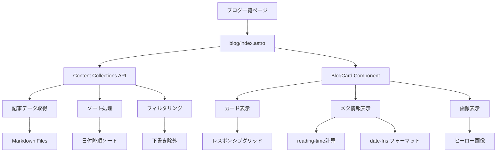

# 詳細設計書 - REQ-002: 記事一覧機能

## 1. 概要

### 1.1 要件概要
- **要件ID**: REQ-002
- **要件名**: 記事一覧機能
- **概要**: ブログ記事の一覧表示機能
- **優先度**: High
- **実装状況**: 🟡 部分完了（ページネーション未実装）

### 1.2 機能詳細
- カード形式での記事一覧表示
- ページネーション機能
- 記事のメタ情報表示（タイトル、説明、公開日、タグ）
- サムネイル画像の表示

## 2. アーキテクチャ設計

### 2.1 システム構成図



### 2.2 データフロー

```
1. ページリクエスト (/blog/)
   ↓
2. getCollection('blog') - 全記事取得
   ↓
3. フィルタリング処理:
   ├─ 下書き除外 (!data.draft)
   └─ 公開日降順ソート
   ↓
4. 並列処理:
   ├─ BlogCard生成 (client:visible)
   ├─ 読了時間計算 (reading-time)
   └─ 日付フォーマット (date-fns)
   ↓
5. グリッドレイアウト表示
```

## 3. コンポーネント設計

### 3.1 主要コンポーネント

#### 3.1.1 blog/index.astro (一覧ページ)

**ファイルパス**: `src/pages/blog/index.astro`

**責務**:
- 記事データの取得と整理
- レイアウトの構築
- BlogCardコンポーネントへの記事データ受け渡し

**実装詳細**:
```typescript
// 記事データ取得
const posts = await getCollection('blog', ({ data }) => !data.draft);

// 公開日降順ソート
const sortedPosts = posts.sort(
  (a, b) => b.data.pubDate.valueOf() - a.data.pubDate.valueOf()
);
```

**レイアウト構造**:
```html
<BaseLayout>
  <Header />
  <main>
    <!-- ヒーローセクション -->
    <section class="bg-gray-50">
      <h1>ブログ記事一覧</h1>
      <p>記事数表示</p>
    </section>
    
    <!-- 記事一覧 -->
    <section>
      <div class="grid grid-cols-1 md:grid-cols-2 lg:grid-cols-3">
        {posts.map(post => (
          <BlogCard post={post} client:visible />
        ))}
      </div>
    </section>
  </main>
  <Footer />
</BaseLayout>
```

#### 3.1.2 BlogCard.tsx (記事カードコンポーネント)

**ファイルパス**: `src/components/react/BlogCard.tsx`

**責務**:
- 個別記事情報のカード表示
- ホバーエフェクトとアニメーション
- メタ情報の整理表示

**Props Interface**:
```typescript
interface BlogCardProps {
  post: CollectionEntry<'blog'>;
  className?: string;
}
```

**主要機能**:
```typescript
// データ抽出
const { title, description, pubDate, heroImage, tags, category } = post.data;

// 日付フォーマット
const formattedDate = format(pubDate, 'yyyy.MM.dd', { locale: ja });

// 読了時間計算
const readTime = readingTime(post.body);
```

**カード構造**:
```jsx
<article className="group bg-white rounded-lg border overflow-hidden hover:shadow-lg transition-all">
  <a href={`/blog/${post.slug}/`}>
    {/* ヒーロー画像 */}
    {heroImage && (
      <div className="aspect-video overflow-hidden">
        
      </div>
    )}
    
    {/* カード本文 */}
    <div className="p-6">
      {/* メタ情報 */}
      <div className="flex items-center gap-4 mb-3 text-sm text-gray-500">
        <time>{formattedDate}</time>
        <span>{readTime.minutes}分</span>
        {category && <span className="badge">{category}</span>}
      </div>
      
      {/* タイトル・説明 */}
      <h2 className="text-xl font-semibold mb-2 line-clamp-2">{title}</h2>
      <p className="text-gray-600 mb-4 line-clamp-3">{description}</p>
      
      {/* タグ */}
      {tags && (
        <div className="flex flex-wrap gap-2">
          {tags.slice(0, 3).map(tag => (
            <span key={tag} className="tag">#{tag}</span>
          ))}
          {tags.length > 3 && <span>+{tags.length - 3}</span>}
        </div>
      )}
    </div>
  </a>
</article>
```

### 3.2 未実装コンポーネント

#### 3.2.1 Pagination.tsx (ページネーションコンポーネント)

**要件**: TASK-006で実装予定

**設計仕様**:
```typescript
interface PaginationProps {
  currentPage: number;
  totalPages: number;
  baseUrl: string;
  className?: string;
}

// 使用例
<Pagination 
  currentPage={1}
  totalPages={Math.ceil(posts.length / POSTS_PER_PAGE)}
  baseUrl="/blog"
/>
```

**実装方針**:
- 1ページあたり12記事表示
- 前後2ページのリンク表示
- 最初・最後ページへのジャンプリンク
- モバイル対応の簡略表示

## 4. データ設計

### 4.1 記事取得ロジック

**ベースクエリ**:
```typescript
const posts = await getCollection('blog', ({ data }) => {
  return !data.draft; // 下書き除外
});
```

**ソート処理**:
```typescript
const sortedPosts = posts.sort((a, b) => 
  b.data.pubDate.valueOf() - a.data.pubDate.valueOf()
);
```

### 4.2 ページネーション設計（未実装）

**ページ分割ロジック**:
```typescript
const POSTS_PER_PAGE = 12;
const totalPages = Math.ceil(posts.length / POSTS_PER_PAGE);

// 動的ルーティング: /blog/page/[page].astro
export async function getStaticPaths() {
  const posts = await getCollection('blog', ({ data }) => !data.draft);
  const totalPages = Math.ceil(posts.length / POSTS_PER_PAGE);
  
  return Array.from({ length: totalPages }, (_, i) => ({
    params: { page: (i + 1).toString() },
    props: {
      posts: posts.slice(i * POSTS_PER_PAGE, (i + 1) * POSTS_PER_PAGE),
      currentPage: i + 1,
      totalPages,
    },
  }));
}
```

### 4.3 メタデータ処理

**読了時間計算**:
```typescript
import readingTime from 'reading-time';

const readTime = readingTime(post.body);
// => { text: "約3分", minutes: 3, time: 180000, words: 600 }
```

**日付フォーマット**:
```typescript
import { format } from 'date-fns';
import { ja } from 'date-fns/locale';

const formattedDate = format(pubDate, 'yyyy.MM.dd', { locale: ja });
// => "2024.01.15"
```

## 5. スタイリング設計

### 5.1 レスポンシブグリッド

**グリッドシステム**:
```css
.grid.grid-cols-1.md:grid-cols-2.lg:grid-cols-3.gap-8 {
  display: grid;
  gap: 2rem;
  grid-template-columns: 1fr;        /* モバイル: 1列 */
}

@media (min-width: 768px) {
  .md:grid-cols-2 {
    grid-template-columns: 1fr 1fr;   /* タブレット: 2列 */
  }
}

@media (min-width: 1024px) {
  .lg:grid-cols-3 {
    grid-template-columns: 1fr 1fr 1fr; /* デスクトップ: 3列 */
  }
}
```

### 5.2 カードデザイン

**カード基本スタイル**:
```css
.card {
  background: white;
  border-radius: 0.5rem;
  border: 1px solid #e5e7eb;
  overflow: hidden;
  transition: all 0.3s ease;
}

.card:hover {
  box-shadow: 0 10px 15px -3px rgba(0, 0, 0, 0.1);
  border-color: #a06d95; /* primary-300 */
}
```

**画像ホバーエフェクト**:
```css
.group:hover .group-hover\\:scale-105 {
  transform: scale(1.05);
}

.transition-transform {
  transition: transform 0.3s ease;
}
```

### 5.3 テキスト切り取り

**line-clamp実装**:
```css
.line-clamp-2 {
  display: -webkit-box;
  -webkit-line-clamp: 2;
  -webkit-box-orient: vertical;
  overflow: hidden;
}

.line-clamp-3 {
  -webkit-line-clamp: 3;
}
```

## 6. パフォーマンス設計

### 6.1 画像最適化

**遅延読み込み**:
```jsx

```

### 6.2 ハイドレーション戦略

**BlogCardの最適化**:
```astro
<!-- 表示時にハイドレーション -->
<BlogCard post={post} client:visible />
```

**利点**:
- 初期ページ読み込み時間短縮
- スクロールして表示される際にJavaScript実行
- 大量記事でもパフォーマンス維持

### 6.3 ページネーション最適化（未実装）

**静的生成アプローチ**:
```typescript
// 全ページを事前生成
// /blog/ (1ページ目)
// /blog/page/2/
// /blog/page/3/
// ...
```

**利点**:
- 各ページが静的ファイルとして配信
- CDNキャッシュ効果
- SEO最適化

## 7. SEO設計

### 7.1 メタタグ設定

**ページメタデータ**:
```typescript
const seoTitle = `ブログ記事一覧 | Tech Blog`;
const seoDescription = `技術ブログの記事一覧です。${posts.length}件の記事を公開中。`;
```

**OGP設定**:
```html
<meta property="og:title" content="ブログ記事一覧 | Tech Blog" />
<meta property="og:description" content="技術ブログの記事一覧..." />
<meta property="og:type" content="website" />
```

### 7.2 構造化データ（実装予定）

**WebSite Schema**:
```json
{
  "@context": "https://schema.org",
  "@type": "WebSite",
  "name": "Tech Blog",
  "url": "https://yourdomain.com",
  "description": "技術に関する記事や学習記録を共有するブログ"
}
```

**ItemList Schema**:
```json
{
  "@context": "https://schema.org",
  "@type": "ItemList",
  "numberOfItems": 15,
  "itemListElement": [
    {
      "@type": "ListItem",
      "position": 1,
      "item": {
        "@type": "Article",
        "headline": "記事タイトル",
        "url": "https://yourdomain.com/blog/article-slug/"
      }
    }
  ]
}
```

## 8. ユーザビリティ設計

### 8.1 ローディング状態

**スケルトンローディング（将来実装）**:
```jsx
const SkeletonCard = () => (
  <div className="animate-pulse">
    <div className="aspect-video bg-gray-200 rounded-t-lg"></div>
    <div className="p-6">
      <div className="h-4 bg-gray-200 rounded mb-2"></div>
      <div className="h-6 bg-gray-200 rounded mb-4"></div>
      <div className="h-4 bg-gray-200 rounded w-3/4"></div>
    </div>
  </div>
);
```

### 8.2 空状態の処理

**記事が0件の場合**:
```jsx
{posts.length === 0 ? (
  <div className="text-center py-12">
    <h3 className="text-lg font-medium text-gray-900">
      記事がまだありません
    </h3>
    <p className="text-gray-500">
      記事が公開されるまでお待ちください。
    </p>
  </div>
) : (
  <div className="grid grid-cols-1 md:grid-cols-2 lg:grid-cols-3 gap-8">
    {posts.map(post => <BlogCard key={post.slug} post={post} />)}
  </div>
)}
```

## 9. アクセシビリティ設計

### 9.1 セマンティックHTML

**記事一覧構造**:
```html
<main role="main">
  <section aria-labelledby="blog-heading">
    <h1 id="blog-heading">ブログ記事一覧</h1>
    
    <div role="list" aria-label="記事一覧">
      <article role="listitem">
        <h2><a href="/blog/article/">記事タイトル</a></h2>
        <time datetime="2024-01-15">2024年1月15日</time>
        <p>記事の説明...</p>
      </article>
    </div>
  </section>
</main>
```

### 9.2 キーボード操作

**フォーカス管理**:
```css
.card:focus-within {
  outline: 2px solid #a06d95;
  outline-offset: 2px;
}

.card a:focus {
  outline: none; /* カード全体のフォーカスを優先 */
}
```

## 10. 今後の実装計画

### 10.1 TASK-006: ページネーション機能

**実装優先度**: Medium

**実装内容**:
1. `/blog/page/[page].astro`ルート作成
2. `Pagination.tsx`コンポーネント実装
3. ページ間のナビゲーション
4. URL構造の設計

**技術的課題**:
- 初期ページ（`/blog/`）とページネーション（`/blog/page/1/`）の重複回避
- SEO考慮のcanonicalタグ設定

### 10.2 検索・フィルタリング機能

**実装内容**:
- タグによる記事フィルタリング
- カテゴリによる記事フィルタリング  
- 日付範囲による記事フィルタリング

### 10.3 ソート機能

**実装内容**:
- 公開日順
- 更新日順
- 人気度順（将来的）
- タイトル順

## 11. 測定・監視

### 11.1 ユーザー行動指標

**記事一覧ページ**:
- 滞在時間
- スクロール深度
- 記事クリック率
- ページネーション利用率

**BlogCard**:
- カードクリック率
- ホバー率
- 表示完了率

### 11.2 パフォーマンス指標

**読み込み性能**:
- LCP: 2.5秒以下
- FID: 100ms以下
- CLS: 0.1以下

**画像最適化**:
- 画像読み込み完了率
- 遅延読み込み効果測定

---

**文書作成日**: 2025-01-15  
**最終更新日**: 2025-01-15  
**作成者**: システム設計書自動生成  
**バージョン**: 1.0  
**関連文書**: 10-requirements.md, 20-basic-design.md, 30-todo-list.md