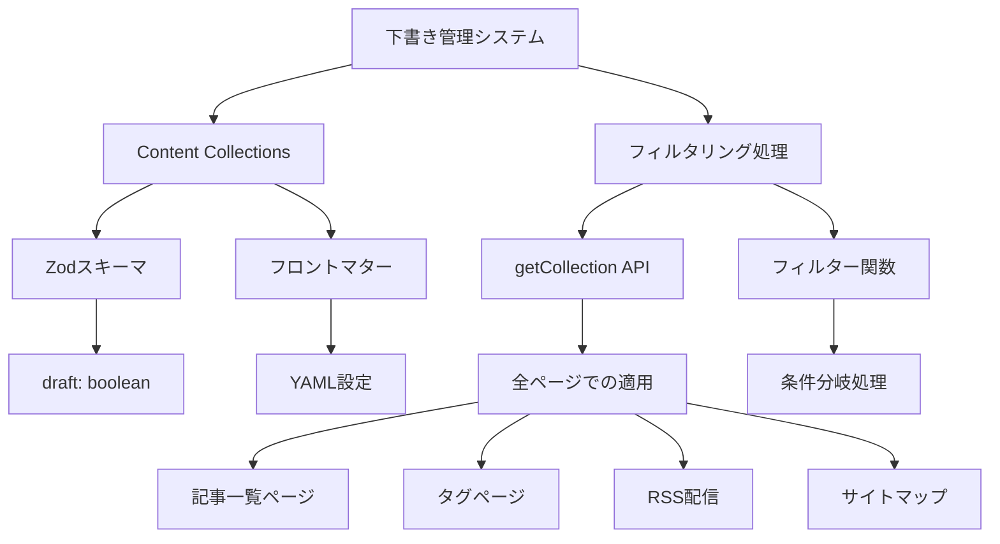

# 詳細設計書 - REQ-004: 下書き機能

## 1. 概要

### 1.1 要件概要
- **要件ID**: REQ-004
- **要件名**: 下書き機能
- **概要**: 記事の下書き管理機能
- **優先度**: Medium
- **実装状況**: ✅ 完了

### 1.2 機能詳細
- `draft: true`フラグによる下書き記事の管理
- 下書き記事は本番環境では表示されない

## 2. アーキテクチャ設計

### 2.1 システム構成図



### 2.2 データフロー

```
1. 記事作成/編集
   ↓
2. フロントマターでdraftフラグ設定
   draft: true  (下書き)
   draft: false (公開)
   ↓
3. Content Collections スキーマバリデーション
   ↓
4. 各ページでのデータ取得時
   ↓
5. フィルタリング処理
   ({ data }) => !data.draft
   ↓
6. 公開記事のみ表示/配信
```

## 3. 実装設計

### 3.1 Content Collections スキーマ

**ファイルパス**: `src/content/config.ts`

**スキーマ定義**:
```typescript
import { defineCollection, z } from 'astro:content';

const blog = defineCollection({
  type: 'content',
  schema: z.object({
    title: z.string(),
    description: z.string(),
    pubDate: z.coerce.date(),
    updatedDate: z.coerce.date().optional(),
    heroImage: z.string().optional(),
    tags: z.array(z.string()),
    category: z.string().optional(),
    draft: z.boolean().default(false),  // デフォルトは公開状態
  }),
});

export const collections = { blog };
```

**重要な設計ポイント**:
- `z.boolean().default(false)`: 明示的に指定しない場合は公開状態
- 型安全性: TypeScriptで下書きフラグの型チェック
- バリデーション: 不正な値の場合はビルドエラー

### 3.2 フロントマター設定

**公開記事の例**:
```yaml
---
title: 'TypeScriptのベストプラクティス'
description: 'TypeScriptを使った開発でのベストプラクティス'
pubDate: 2024-01-15
tags: ['TypeScript', 'JavaScript']
category: '技術'
draft: false  # 明示的に公開指定
---
```

**下書き記事の例**:
```yaml
---
title: '執筆中の記事タイトル'
description: 'まだ作成中の記事です'
pubDate: 2024-01-20
tags: ['執筆中']
category: '技術'
draft: true   # 下書き状態
---
```

**省略時の動作**:
```yaml
---
title: '記事タイトル'
description: '記事の説明'
pubDate: 2024-01-15
tags: ['タグ']
# draft: 省略時はfalse（公開）がデフォルト
---
```

## 4. フィルタリング実装

### 4.1 基本フィルター関数

**共通フィルター**:
```typescript
// 下書きを除外する共通フィルター
const publishedFilter = ({ data }: CollectionEntry<'blog'>) => !data.draft;

// 使用例
const posts = await getCollection('blog', publishedFilter);
```

### 4.2 各ページでの実装

#### 4.2.1 記事一覧ページ

**ファイルパス**: `src/pages/blog/index.astro`

```typescript
---
import { getCollection } from 'astro:content';

// 公開記事のみ取得
const posts = await getCollection('blog', ({ data }) => !data.draft);

// 公開日降順ソート
const sortedPosts = posts.sort(
  (a, b) => b.data.pubDate.valueOf() - a.data.pubDate.valueOf()
);
---
```

#### 4.2.2 動的記事ページ

**ファイルパス**: `src/pages/blog/[...slug].astro`

```typescript
---
export async function getStaticPaths() {
  // 下書きを除外して静的パス生成
  const posts = await getCollection('blog', ({ data }) => !data.draft);
  
  return posts.map(post => ({
    params: { slug: post.slug },
    props: post,
  }));
}
---
```

#### 4.2.3 タグ別記事一覧

**ファイルパス**: `src/pages/tags/[tag].astro`

```typescript
---
export async function getStaticPaths() {
  // 公開記事のみからタグを抽出
  const allPosts = await getCollection('blog', ({ data }) => !data.draft);
  const uniqueTags = [...new Set(allPosts.flatMap(post => post.data.tags))];

  return uniqueTags.map(tag => {
    // 指定タグかつ公開記事のフィルタリング
    const filteredPosts = allPosts
      .filter(post => post.data.tags.includes(tag))
      .sort((a, b) => b.data.pubDate.valueOf() - a.data.pubDate.valueOf());

    return {
      params: { tag },
      props: { posts: filteredPosts, tag },
    };
  });
}
---
```

#### 4.2.4 RSS配信

**ファイルパス**: `src/pages/rss.xml.js`

```javascript
import rss from '@astrojs/rss';
import { getCollection } from 'astro:content';

export async function GET(context) {
  // RSS配信では下書きを確実に除外
  const posts = await getCollection('blog', ({ data }) => !data.draft);

  return rss({
    title: 'Tech Blog',
    description: '技術ブログ',
    site: context.site,
    items: posts
      .sort((a, b) => b.data.pubDate.valueOf() - a.data.pubDate.valueOf())
      .map(post => ({
        title: post.data.title,
        pubDate: post.data.pubDate,
        description: post.data.description,
        link: `/blog/${post.slug}/`,
        categories: post.data.tags,
      })),
  });
}
```

## 5. 開発環境での下書き表示

### 5.1 環境変数による制御

**astro.config.mjs での設定**:
```javascript
import { defineConfig } from 'astro/config';

export default defineConfig({
  // 開発環境では下書きも表示
  vite: {
    define: {
      __SHOW_DRAFTS__: process.env.NODE_ENV === 'development',
    },
  },
});
```

**条件分岐フィルター**:
```typescript
const isDevelopment = import.meta.env.DEV;

// 開発環境では下書きも含める
const posts = await getCollection('blog', ({ data }) => {
  if (isDevelopment) {
    return true; // 開発時は全記事表示
  }
  return !data.draft; // 本番時は公開記事のみ
});
```

### 5.2 下書き識別表示

**開発環境での視覚的識別**:
```astro
---
const isDraft = post.data.draft;
const isDevelopment = import.meta.env.DEV;
---

{isDevelopment && isDraft && (
  <div class="draft-badge">
    <span class="bg-yellow-100 text-yellow-800 px-2 py-1 rounded-full text-xs font-medium">
      下書き
    </span>
  </div>
)}
```

## 6. エラーハンドリング

### 6.1 フロントマター検証

**不正な値の処理**:
```typescript
// Zodスキーマが自動的にバリデーション
draft: z.boolean().default(false)

// 以下は全てfalseとして処理される
// draft: "false"  -> false (文字列から変換)
// draft: 0        -> false (数値から変換)  
// draft: null     -> false (デフォルト値)
// draft: undefined -> false (デフォルト値)
```

### 6.2 ビルド時エラー

**型エラーの例**:
```yaml
---
title: 'テスト記事'
draft: "invalid"  # 無効な値
---
```

**エラーメッセージ**:
```
Error: 
Expected boolean, received string at "draft"
```

## 7. セキュリティ設計

### 7.1 意図しない公開の防止

**二重チェック機構**:
```typescript
// 1. Content Collections レベルでの検証
schema: z.object({
  draft: z.boolean().default(false),
})

// 2. 各ページでの明示的フィルタリング
const posts = await getCollection('blog', ({ data }) => !data.draft);

// 3. ビルド時での最終確認
if (import.meta.env.PROD && post.data.draft) {
  throw new Error(`Draft post found in production: ${post.slug}`);
}
```

### 7.2 下書きURLの無効化

**直接アクセス防止**:
```typescript
// getStaticPaths()で下書きは除外されるため
// 下書き記事への直接URLアクセスは404エラーになる

// 例: /blog/draft-article/ → 404 Not Found
```

## 8. パフォーマンス考慮

### 8.1 ビルド時最適化

**静的生成最適化**:
```typescript
// 下書きは静的パス生成から除外されるため
// ビルド時間とサイズが最適化される

const publicPosts = await getCollection('blog', ({ data }) => !data.draft);
// 下書き記事はHTMLファイルが生成されない
```

### 8.2 検索インデックス最適化

**Pagefind設定**:
```typescript
// 下書きページは生成されないため
// 自動的に検索インデックスからも除外される
```

## 9. 運用・管理

### 9.1 下書き一覧の確認

**開発用スクリプト**:
```typescript
// scripts/list-drafts.mjs
import { getCollection } from 'astro:content';

const allPosts = await getCollection('blog');
const drafts = allPosts.filter(post => post.data.draft);

console.log('下書き記事一覧:');
drafts.forEach(post => {
  console.log(`- ${post.data.title} (${post.slug})`);
});
```

### 9.2 一括公開機能

**下書きから公開への変更**:
```bash
# 下書きフラグを一括変更するスクリプト例
find src/content/blog -name "*.md" -exec sed -i 's/draft: true/draft: false/g' {} \;
```

## 10. テスト設計

### 10.1 フィルタリングテスト

**テストケース**:
```typescript
// tests/draft-filter.test.ts
import { getCollection } from 'astro:content';

describe('下書きフィルタリング', () => {
  test('公開記事のみ取得される', async () => {
    const posts = await getCollection('blog', ({ data }) => !data.draft);
    
    // 全ての記事のdraftフラグがfalseであることを確認
    posts.forEach(post => {
      expect(post.data.draft).toBe(false);
    });
  });

  test('下書き記事は除外される', async () => {
    const allPosts = await getCollection('blog');
    const publicPosts = await getCollection('blog', ({ data }) => !data.draft);
    
    // 下書きがある場合、公開記事数は全記事数より少ない
    expect(publicPosts.length).toBeLessThanOrEqual(allPosts.length);
  });
});
```

### 10.2 ビルドテスト

**CI/CDでの確認**:
```yaml
# .github/workflows/test.yml
- name: Check for drafts in production
  run: |
    # 本番ビルドで下書きが含まれていないことを確認
    npm run build
    ! grep -r "draft: true" dist/ || exit 1
```

## 11. 今後の拡張計画

### 11.1 下書きプレビュー機能

**実装案**:
- プレビュー専用ルート: `/preview/[slug]/`
- 認証付きアクセス制御
- プレビューリンクの生成

### 11.2 公開予約機能

**実装案**:
```typescript
schema: z.object({
  // 既存フィールド...
  publishAt: z.coerce.date().optional(), // 公開予定日時
  draft: z.boolean().default(false),
})

// 未来日の記事も下書き扱い
const filter = ({ data }) => {
  if (data.draft) return false;
  if (data.publishAt && data.publishAt > new Date()) return false;
  return true;
};
```

### 11.3 下書き管理UI

**実装案**:
- 下書き一覧ページ（開発環境のみ）
- 下書き状態の切り替えUI
- 下書き期間の可視化

---

**文書作成日**: 2025-01-15  
**最終更新日**: 2025-01-15  
**作成者**: システム設計書自動生成  
**バージョン**: 1.0  
**関連文書**: 10-requirements.md, 20-basic-design.md, 30-todo-list.md