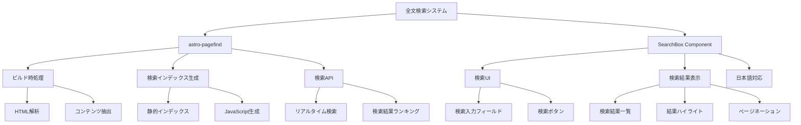

# 詳細設計書 - REQ-005: 全文検索機能

## 1. 概要

### 1.1 要件概要
- **要件ID**: REQ-005
- **要件名**: 全文検索機能
- **概要**: ブログ記事の全文検索機能
- **優先度**: High
- **実装状況**: ✅ 完了

### 1.2 機能詳細
- astro-pagefindによる静的サイト全文検索
- 記事タイトル、本文、メタ情報を対象とした検索
- 検索結果のハイライト表示とドロップダウン表示
- 検索ボックスのヘッダー配置（デスクトップ・モバイル対応）
- リアルタイム検索とデバウンス処理
- キーボードナビゲーション対応（Enter、Escape）

## 2. アーキテクチャ設計

### 2.1 システム構成図



### 2.2 データフロー

```
【ビルド時】
1. astro build実行
   ↓
2. 全HTMLファイルの解析
   ↓
3. data-pagefind-body属性でコンテンツ抽出
   ↓
4. 検索インデックス生成 (pagefind/index/)
   ↓
5. 検索JavaScript生成 (pagefind/pagefind.js)

【検索時】
1. ユーザーが検索語を入力
   ↓
2. pagefind.search() API呼び出し
   ↓
3. 静的インデックスから検索
   ↓
4. 検索結果取得
   ↓
5. UI更新（結果表示、ハイライト）
```

## 3. 実装設計

### 3.1 Astro設定

**ファイルパス**: `astro.config.mjs`

```javascript
import { defineConfig } from 'astro/config';
import pagefind from 'astro-pagefind';

export default defineConfig({
  integrations: [
    // ... 他のintegrations
    pagefind(),
  ],
});
```

### 3.2 SearchBox コンポーネント

**ファイルパス**: `src/components/react/SearchBox.tsx`

**基本構造**:
```tsx
import React, { useState, useEffect, useRef } from 'react';

interface SearchBoxProps {
  placeholder?: string;
  className?: string;
  compact?: boolean;
}

export default function SearchBox({ 
  placeholder = "記事を検索...", 
  className = "",
  compact = false 
}: SearchBoxProps) {
  const [query, setQuery] = useState('');
  const [results, setResults] = useState<SearchResult[]>([]);
  const [isOpen, setIsOpen] = useState(false);
  const [isLoading, setIsLoading] = useState(false);
  const [pagefind, setPagefind] = useState<any>(null);

  // Pagefindの動的ロードとリアルタイム検索
  // デバウンス処理、キーボードナビゲーション対応
  // 検索結果のハイライト表示

  return (
    <div className="relative">
      {/* 検索入力フィールド */}
      <input ... />
      
      {/* 検索結果ドロップダウン */}
      {isOpen && <div>...</div>}
    </div>
  );
}
```

**機能詳細**:
- リアルタイム検索（300msデバウンス）
- 検索結果のドロップダウン表示
- キーワードハイライト機能
- キーボードナビゲーション（Enter、Escape）
- ダークモード対応
- レスポンシブデザイン

### 3.3 ヘッダー統合

**ファイルパス**: `src/components/react/Header.tsx`

```tsx
// デスクトップ版検索ボックス
<div className="hidden md:block flex-1 max-w-md mx-8">
  <SearchBox compact placeholder="記事を検索..." />
</div>
```

**ファイルパス**: `src/components/react/MobileMenu.tsx`

```tsx
// モバイル版検索ボックス
<div className="px-4 pt-3 pb-2 border-b border-gray-200 dark:border-gray-700">
  <SearchBox compact placeholder="記事を検索..." />
</div>
```

**UI配置**:
- **デスクトップ**: ヘッダー中央、ナビゲーションとテーマトグル間
- **モバイル**: ハンバーガーメニュー内上部、ナビゲーション項目より上

### 3.4 検索対象コンテンツの指定

**BlogLayout.astro での設定**:
```astro
<BaseLayout title={title} description={description} image={heroImage}>
  <div class="min-h-screen flex flex-col">
    <Header currentPath={currentPath} client:load />

    <!-- 検索対象となるメインコンテンツ -->
    <main class="flex-1" data-pagefind-body>
      <article class="max-w-4xl mx-auto px-4 sm:px-6 lg:px-8 py-8"
               data-pagefind-meta="title,date,tags">
        <!-- 記事のメタデータ -->
        <div data-pagefind-meta="title">{title}</div>
        <div data-pagefind-meta="date">{formattedDate}</div>
        <div data-pagefind-meta="tags">{tags.join(', ')}</div>
        
        <!-- 記事本文 -->
        <div class="prose prose-lg dark:prose-invert">
          <Content />
        </div>
      </article>
    </main>

    <Footer />
  </div>
</BaseLayout>
```

## 4. UI設計

### 4.1 検索ボックススタイル

**カスタムCSS**:
```css
/* 検索入力フィールド */
:global(.pagefind-ui__search-input) {
  width: 100%;
  padding: 0.5rem 1rem 0.5rem 2.5rem;
  border: 1px solid #d1d5db;
  border-radius: 0.5rem;
  background-color: white;
  color: #111827;
  background-image: url("data:image/svg+xml,%3csvg xmlns='http://www.w3.org/2000/svg' fill='%236b7280' viewBox='0 0 20 20'%3e%3cpath fill-rule='evenodd' d='M8 4a4 4 0 100 8 4 4 0 000-8zM2 8a6 6 0 1110.89 3.476l4.817 4.817a1 1 0 01-1.414 1.414l-4.816-4.816A6 6 0 012 8z' clip-rule='evenodd'/%3e%3c/svg%3e");
  background-position: 0.75rem center;
  background-repeat: no-repeat;
  background-size: 1.25rem;
  transition: all 0.2s;
}

/* フォーカス状態 */
:global(.pagefind-ui__search-input:focus) {
  outline: none;
  ring: 2px;
  ring-color: #a06d95; /* primary-500 */
  border-color: transparent;
}

/* ダークモード対応 */
:global(.dark .pagefind-ui__search-input) {
  border-color: #4b5563;
  background-color: #1f2937;
  color: white;
  background-image: url("data:image/svg+xml,%3csvg xmlns='http://www.w3.org/2000/svg' fill='%239ca3af' viewBox='0 0 20 20'%3e%3cpath fill-rule='evenodd' d='M8 4a4 4 0 100 8 4 4 0 000-8zM2 8a6 6 0 1110.89 3.476l4.817 4.817a1 1 0 01-1.414 1.414l-4.816-4.816A6 6 0 012 8z' clip-rule='evenodd'/%3e%3c/svg%3e");
}
```

### 4.2 検索結果エリア

**結果表示スタイル**:
```css
/* 検索結果コンテナ */
:global(.pagefind-ui__results-area) {
  margin-top: 0.5rem;
  background-color: white;
  border-radius: 0.5rem;
  box-shadow: 0 10px 15px -3px rgba(0, 0, 0, 0.1);
  border: 1px solid #e5e7eb;
  max-height: 24rem;
  overflow-y: auto;
  z-index: 50;
}

/* ダークモード */
:global(.dark .pagefind-ui__results-area) {
  background-color: #1f2937;
  border-color: #374151;
}

/* 個別結果アイテム */
:global(.pagefind-ui__result) {
  padding: 1rem;
  border-bottom: 1px solid #e5e7eb;
  transition: background-color 0.2s;
}

:global(.pagefind-ui__result:hover) {
  background-color: #f9fafb;
}

:global(.dark .pagefind-ui__result:hover) {
  background-color: #374151;
}

/* 結果タイトル */
:global(.pagefind-ui__result-title) {
  font-weight: 500;
  color: #111827;
  margin-bottom: 0.25rem;
  font-size: 1rem;
  line-height: 1.5rem;
}

:global(.dark .pagefind-ui__result-title) {
  color: white;
}

/* 結果抜粋 */
:global(.pagefind-ui__result-excerpt) {
  color: #6b7280;
  font-size: 0.875rem;
  line-height: 1.25rem;
}

:global(.dark .pagefind-ui__result-excerpt) {
  color: #d1d5db;
}
```

## 5. 検索機能詳細

### 5.1 インデックス生成

**対象コンテンツ**:
```html
<!-- ページ全体を検索対象に指定 -->
<main data-pagefind-body>
  <!-- メタデータの指定 -->
  <article data-pagefind-meta="title,date,tags,category">
    <h1 data-pagefind-meta="title">記事タイトル</h1>
    <time data-pagefind-meta="date">2024-01-15</time>
    <div data-pagefind-meta="tags">TypeScript,React</div>
    <div data-pagefind-meta="category">技術</div>
    
    <!-- 検索対象本文 -->
    <div class="prose">
      記事の本文内容...
    </div>
  </article>
</main>

<!-- 検索対象外に指定 -->
<footer data-pagefind-ignore>
  フッター内容は検索対象外
</footer>
```

### 5.2 検索アルゴリズム

**Pagefind の検索仕様**:
- **完全一致**: 指定した単語の完全一致
- **部分一致**: 前方一致での検索
- **複数単語**: AND検索（全ての単語を含む）
- **フレーズ検索**: ダブルクォートで囲んだフレーズ検索
- **除外検索**: -単語 で除外指定

**検索例**:
```
React TypeScript     → ReactとTypeScriptを含む記事
"React hooks"        → "React hooks"フレーズを含む記事  
React -Vue          → Reactを含むがVueを含まない記事
```

### 5.3 検索結果ランキング

**スコアリング要素**:
1. **タイトル一致**: 最高スコア
2. **見出し一致**: 高スコア
3. **本文一致**: 標準スコア
4. **一致頻度**: 多いほど高スコア
5. **近接度**: 検索語同士が近いほど高スコア

## 6. パフォーマンス設計

### 6.1 インデックスサイズ最適化

**設定オプション**:
```javascript
// astro-pagefind設定
pagefind({
  forceLanguage: 'ja',           // 日本語に特化
  excludeSelectors: [            // 除外セレクター
    'nav',
    'footer', 
    '.sidebar',
    '[data-pagefind-ignore]'
  ],
  excerptLength: 30,             // 抜粋長さ制限
})
```

### 6.2 検索レスポンス最適化

**遅延読み込み**:
```typescript
// 検索ライブラリの遅延読み込み
let pagefind;

const search = async (query: string) => {
  if (!pagefind) {
    pagefind = await import('/pagefind/pagefind.js');
  }
  
  const results = await pagefind.search(query);
  return results;
};
```

**デバウンス処理**:
```typescript
const useDebounce = (value: string, delay: number) => {
  const [debouncedValue, setDebouncedValue] = useState(value);

  useEffect(() => {
    const handler = setTimeout(() => {
      setDebouncedValue(value);
    }, delay);

    return () => {
      clearTimeout(handler);
    };
  }, [value, delay]);

  return debouncedValue;
};

// 使用例：300ms後に検索実行
const debouncedSearchTerm = useDebounce(searchTerm, 300);
```

## 7. 日本語対応

### 7.1 言語設定

**Pagefind言語設定**:
```javascript
// astro.config.mjs
pagefind({
  forceLanguage: 'ja',  // 日本語検索アルゴリズム
})
```

### 7.2 日本語UI翻訳

**完全日本語化**:
```typescript
const translations = {
  placeholder: '記事を検索...',
  clear_search: '検索をクリア', 
  load_more: 'さらに表示',
  search_label: 'このサイトを検索',
  filters_label: 'フィルター',
  zero_results: '検索結果が見つかりませんでした: [SEARCH_TERM]',
  many_results: '[COUNT]件の結果が見つかりました: [SEARCH_TERM]',
  one_result: '1件の結果が見つかりました: [SEARCH_TERM]',
  alt_search: '[SEARCH_TERM]の検索',
  search_suggestion: '次を検索してください: [SEARCH_TERM]',
  searching: '検索中: [SEARCH_TERM]...',
};
```

### 7.3 日本語検索最適化

**分かち書き対応**:
```
// Pagefindは自動的に日本語の分かち書きを処理
"TypeScript入門" → ["TypeScript", "入門"] で検索可能
"React関数コンポーネント" → 各単語で分割検索
```

## 8. セキュリティ設計

### 8.1 検索対象の制御

**機密情報の除外**:
```html
<!-- 管理者専用情報を検索対象外に -->
<div class="admin-only" data-pagefind-ignore>
  管理者情報（検索対象外）
</div>

<!-- 下書き記事は自動的に除外される -->
<!-- draft: true の記事はHTMLが生成されないため -->
```

### 8.2 XSS対策

**検索結果のサニタイズ**:
```typescript
// Pagefindは自動的にHTMLエスケープを実行
// ユーザー入力のスクリプトタグなどは無害化される
```

## 9. アクセシビリティ設計

### 9.1 キーボード操作

**ショートカットキー**:
```typescript
// '/' キーで検索ボックスにフォーカス
document.addEventListener('keydown', (e) => {
  if (e.key === '/' && !isInputFocused()) {
    e.preventDefault();
    document.getElementById('search')?.focus();
  }
});
```

**フォーカス管理**:
```css
.pagefind-ui__search-input:focus {
  outline: 2px solid #a06d95;
  outline-offset: 2px;
}

.pagefind-ui__result:focus-within {
  background-color: #f3f4f6;
  outline: 2px solid #a06d95;
}
```

### 9.2 スクリーンリーダー対応

**ARIA属性**:
```html
<div role="search" aria-label="サイト内検索">
  <input 
    type="search"
    aria-label="検索キーワードを入力"
    aria-describedby="search-help"
  />
  <div id="search-help" class="sr-only">
    記事のタイトルや本文から検索できます
  </div>
</div>

<div role="region" aria-label="検索結果" aria-live="polite">
  <!-- 検索結果が動的に更新される -->
</div>
```

## 10. 分析・改善

### 10.1 検索ログ分析

**検索クエリ追跡**:
```typescript
// Google Analytics連携例
const trackSearch = (query: string, resultsCount: number) => {
  gtag('event', 'search', {
    search_term: query,
    search_results: resultsCount,
  });
};
```

### 10.2 検索精度改善

**同義語対応**:
```typescript
// 検索クエリの正規化
const normalizeQuery = (query: string): string => {
  const synonyms = {
    'js': 'javascript',
    'ts': 'typescript', 
    'css': 'スタイルシート',
    'html': 'マークアップ',
  };
  
  return query.replace(/\b(js|ts|css|html)\b/gi, (match) => {
    return synonyms[match.toLowerCase()] || match;
  });
};
```

## 11. 今後の拡張計画

### 11.1 高度な検索機能

**実装予定**:
- **ファセット検索**: タグ・カテゴリでの絞り込み
- **日付範囲検索**: 期間指定での検索
- **検索履歴**: 過去の検索クエリ保存
- **検索候補**: オートコンプリート機能

### 11.2 検索体験向上

**実装予定**:
- **検索結果プレビュー**: ホバーでの記事プレビュー
- **関連検索**: 類似クエリの提案
- **人気検索**: よく検索されるキーワード表示
- **検索統計**: 検索傾向の可視化

### 11.3 AI検索機能

**将来的な拡張**:
- **セマンティック検索**: 意味ベースの検索
- **自然言語検索**: 質問文での検索
- **要約機能**: 検索結果の自動要約

---

**文書作成日**: 2025-01-15  
**最終更新日**: 2025-01-15  
**作成者**: システム設計書自動生成  
**バージョン**: 1.0  
**関連文書**: 10-requirements.md, 20-basic-design.md, 30-todo-list.md