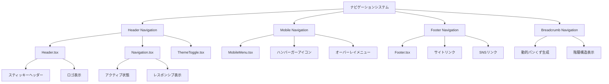

# 詳細設計書 - REQ-006: サイトナビゲーション

## 1. 概要

### 1.1 要件概要
- **要件ID**: REQ-006
- **要件名**: サイトナビゲーション
- **概要**: サイト内のナビゲーション機能
- **優先度**: High
- **実装状況**: 🟡 部分完了（パンくずナビ部分実装）

### 1.2 機能詳細
- ヘッダーナビゲーション（ホーム、ブログ、About、お問い合わせ）
- モバイル用ハンバーガーメニュー
- フッターナビゲーション
- パンくずナビゲーション

## 2. アーキテクチャ設計

### 2.1 システム構成図



### 2.2 ナビゲーション階層

```
サイト構造:
/
├── / (ホーム)
├── /blog/ (ブログ一覧)
│   └── /blog/[slug]/ (記事詳細)
├── /tags/ (タグ一覧)
│   └── /tags/[tag]/ (タグ別記事)
├── /about/ (About)
├── /contact/ (お問い合わせ)
└── /privacy/ (プライバシーポリシー)
```

## 3. コンポーネント設計

### 3.1 Header.tsx (メインヘッダー)

**ファイルパス**: `src/components/react/Header.tsx`

**Props Interface**:
```typescript
interface HeaderProps {
  currentPath: string;
}
```

**レイアウト構造**:
```jsx
<header className="sticky top-0 z-50 bg-white/90 dark:bg-gray-900/90 backdrop-blur-sm border-b">
  <div className="max-w-7xl mx-auto px-4 sm:px-6 lg:px-8">
    <div className="flex items-center justify-between h-16">
      {/* ロゴ */}
      <div className="flex-shrink-0">
        <a href="/" className="flex items-center gap-3 group">
          <div className="logo-icon">
            <svg>...</svg>
          </div>
          <span className="site-title">Tech Blog</span>
        </a>
      </div>

      {/* デスクトップナビゲーション */}
      <div className="hidden md:block flex-1 max-w-lg mx-8">
        <Navigation currentPath={currentPath} />
      </div>

      {/* ツールバー */}
      <div className="flex items-center gap-4">
        <ThemeToggle />
        <MobileMenu navItems={navItems} currentPath={currentPath} />
      </div>
    </div>
  </div>
</header>
```

**スティッキーヘッダー機能**:
```css
.sticky.top-0 {
  position: sticky;
  top: 0;
  z-index: 50;
}

.bg-white\/90 {
  background-color: rgba(255, 255, 255, 0.9);
}

.backdrop-blur-sm {
  backdrop-filter: blur(4px);
}
```

### 3.2 Navigation.tsx (デスクトップナビ)

**ファイルパス**: `src/components/react/Navigation.tsx`

**Props Interface**:
```typescript
interface NavItem {
  href: string;
  label: string;
}

interface NavigationProps {
  mobile?: boolean;
  currentPath: string;
  className?: string;
}
```

**ナビゲーション設定**:
```typescript
const navItems: NavItem[] = [
  { href: '/', label: 'ホーム' },
  { href: '/blog/', label: 'ブログ' },
  { href: '/tags/', label: 'タグ' },
  { href: '/about/', label: 'About' },
  { href: '/contact/', label: 'お問い合わせ' },
];
```

**アクティブ状態判定**:
```typescript
const isActiveLink = (href: string) => {
  return (
    currentPath === href || 
    (href !== '/' && currentPath.startsWith(href))
  );
};

const getLinkClasses = (href: string) => {
  const baseClasses = 'px-3 py-2 text-sm font-medium rounded-md transition-colors';
  const activeClasses = 'text-primary-600 dark:text-primary-400 bg-primary-50 dark:bg-primary-900/20';
  const inactiveClasses = 'text-gray-700 dark:text-gray-300 hover:text-primary-600 dark:hover:text-primary-400 hover:bg-gray-50 dark:hover:bg-gray-800';

  return `${baseClasses} ${
    isActiveLink(href) ? activeClasses : inactiveClasses
  }`;
};
```

### 3.3 MobileMenu.tsx (モバイルメニュー)

**ファイルパス**: `src/components/react/MobileMenu.tsx`

**Props Interface**:
```typescript
interface MobileMenuProps {
  navItems: NavItem[];
  currentPath: string;
  className?: string;
}
```

**状態管理**:
```typescript
const [isOpen, setIsOpen] = useState(false);
const menuRef = useRef<HTMLDivElement>(null);
const buttonRef = useRef<HTMLButtonElement>(null);

// 外部クリックでメニューを閉じる
useEffect(() => {
  const handleClickOutside = (event: MouseEvent) => {
    if (
      menuRef.current &&
      buttonRef.current &&
      !menuRef.current.contains(event.target as Node) &&
      !buttonRef.current.contains(event.target as Node)
    ) {
      setIsOpen(false);
    }
  };

  document.addEventListener('mousedown', handleClickOutside);
  return () => document.removeEventListener('mousedown', handleClickOutside);
}, []);

// ESCキーでメニューを閉じる
useEffect(() => {
  const handleEscapeKey = (event: KeyboardEvent) => {
    if (event.key === 'Escape') {
      setIsOpen(false);
    }
  };

  document.addEventListener('keydown', handleEscapeKey);
  return () => document.removeEventListener('keydown', handleEscapeKey);
}, []);
```

**ハンバーガーメニューUI**:
```jsx
<div className="md:hidden">
  {/* ハンバーガーボタン */}
  <button
    ref={buttonRef}
    type="button"
    onClick={toggleMenu}
    className="hamburger-button"
    aria-controls="mobile-menu"
    aria-expanded={isOpen}
  >
    <span className="sr-only">メニューを開く</span>
    <svg className="hamburger-icon">
      <path d="M4 6h16M4 12h16M4 18h16" />
    </svg>
  </button>

  {/* モバイルメニュー */}
  <div
    ref={menuRef}
    className={`mobile-menu ${
      isOpen ? 'opacity-100 translate-y-0' : 'opacity-0 -translate-y-2 pointer-events-none'
    }`}
  >
    <nav className="px-4 pt-2 pb-3 space-y-1">
      {navItems.map(item => (
        <a
          key={item.href}
          href={item.href}
          onClick={() => setIsOpen(false)}
          className="mobile-nav-link"
        >
          {item.label}
        </a>
      ))}
    </nav>
  </div>
</div>
```

### 3.4 Footer.tsx (フッター)

**ファイルパス**: `src/components/react/Footer.tsx`

**基本構造**:
```jsx
<footer className="bg-gray-50 dark:bg-gray-900 border-t border-gray-200 dark:border-gray-800">
  <div className="max-w-7xl mx-auto px-4 sm:px-6 lg:px-8 py-12">
    <div className="grid grid-cols-1 md:grid-cols-4 gap-8">
      {/* サイト情報 */}
      <div className="col-span-1 md:col-span-2">
        <div className="flex items-center gap-3 mb-4">
          <div className="logo-icon">
            <svg>...</svg>
          </div>
          <span className="text-xl font-bold">Tech Blog</span>
        </div>
        <p className="text-gray-600 dark:text-gray-400 mb-4">
          技術に関する記事や学習記録、開発の知見を共有するブログです。
        </p>
      </div>

      {/* クイックリンク */}
      <div>
        <h3 className="footer-heading">クイックリンク</h3>
        <ul className="footer-links">
          <li><a href="/blog/">ブログ</a></li>
          <li><a href="/tags/">タグ</a></li>
          <li><a href="/about/">About</a></li>
          <li><a href="/contact/">お問い合わせ</a></li>
        </ul>
      </div>

      {/* その他 */}
      <div>
        <h3 className="footer-heading">その他</h3>
        <ul className="footer-links">
          <li><a href="/privacy/">プライバシーポリシー</a></li>
          <li><a href="/rss.xml">RSS</a></li>
        </ul>
      </div>
    </div>

    {/* コピーライト */}
    <div className="border-t border-gray-200 dark:border-gray-700 pt-8 mt-8">
      <p className="text-center text-gray-500 dark:text-gray-400">
        © 2024 Tech Blog. All rights reserved.
      </p>
    </div>
  </div>
</footer>
```

### 3.5 パンくずナビゲーション (部分実装)

**現在の実装**: タグページのみ

**ファイルパス**: `src/pages/tags/[tag].astro`

```html
<nav aria-label="Breadcrumb">
  <ol class="inline-flex items-center space-x-1 md:space-x-3">
    <li class="inline-flex items-center">
      <a href="/" class="breadcrumb-link">ホーム</a>
    </li>
    <li>
      <div class="flex items-center">
        <svg class="breadcrumb-separator">...</svg>
        <a href="/tags/" class="breadcrumb-link">タグ</a>
      </div>
    </li>
    <li aria-current="page">
      <div class="flex items-center">
        <svg class="breadcrumb-separator">...</svg>
        <span class="breadcrumb-current">#{tag}</span>
      </div>
    </li>
  </ol>
</nav>
```

**未実装箇所**:
- ブログ記事ページのパンくず
- カテゴリページのパンくず
- 動的パンくず生成機能

## 4. スタイリング設計

### 4.1 レスポンシブナビゲーション

**ブレークポイント戦略**:
```css
/* モバイル（〜767px）: ハンバーガーメニューのみ */
.md\\:hidden {
  display: block;
}

.hidden.md\\:block {
  display: none;
}

/* タブレット・デスクトップ（768px〜）: 水平ナビ */
@media (min-width: 768px) {
  .md\\:hidden {
    display: none;
  }
  
  .hidden.md\\:block {
    display: block;
  }
}
```

### 4.2 アニメーション設計

**ハンバーガーメニューアニメーション**:
```css
.mobile-menu {
  position: absolute;
  top: 100%;
  left: 0;
  right: 0;
  background: white;
  border-top: 1px solid #e5e7eb;
  box-shadow: 0 10px 15px -3px rgba(0, 0, 0, 0.1);
  z-index: 50;
  transition: all 0.2s ease-in-out;
}

.mobile-menu.open {
  opacity: 1;
  transform: translateY(0);
}

.mobile-menu.closed {
  opacity: 0;
  transform: translateY(-8px);
  pointer-events: none;
}
```

**ホバーエフェクト**:
```css
.nav-link {
  position: relative;
  transition: all 0.2s ease;
}

.nav-link:hover {
  color: #a06d95;
  background-color: #f9fafb;
}

.nav-link.active {
  color: #a06d95;
  background-color: #fdf2f8;
  font-weight: 500;
}
```

## 5. アクセシビリティ設計

### 5.1 キーボードナビゲーション

**フォーカス管理**:
```css
.nav-link:focus {
  outline: 2px solid #a06d95;
  outline-offset: 2px;
  border-radius: 0.25rem;
}

.hamburger-button:focus {
  outline: 2px solid #a06d95;
  outline-offset: 2px;
}
```

**タブオーダー**:
```jsx
<header>
  <a href="/" tabIndex={0}>ロゴ</a>
  <nav>
    <a href="/blog/" tabIndex={0}>ブログ</a>
    <a href="/about/" tabIndex={0}>About</a>
  </nav>
  <button tabIndex={0}>テーマ切り替え</button>
  <button tabIndex={0}>メニュー</button>
</header>
```

### 5.2 ARIA属性

**ナビゲーション識別**:
```html
<nav role="navigation" aria-label="メインナビゲーション">
  <ul role="list">
    <li role="listitem">
      <a href="/blog/" aria-current="page">ブログ</a>
    </li>
  </ul>
</nav>

<button 
  aria-controls="mobile-menu"
  aria-expanded="false"
  aria-label="メニューを開く"
>
  <span aria-hidden="true">≡</span>
</button>
```

**パンくずナビ**:
```html
<nav aria-label="パンくずナビゲーション">
  <ol role="list">
    <li role="listitem">
      <a href="/">ホーム</a>
    </li>
    <li role="listitem" aria-current="page">
      <span>現在のページ</span>
    </li>
  </ol>
</nav>
```

## 6. SEO設計

### 6.1 構造化データ

**SiteNavigationElement Schema**:
```json
{
  "@context": "https://schema.org",
  "@type": "SiteNavigationElement",
  "name": "メインナビゲーション",
  "url": "https://yourdomain.com",
  "hasPart": [
    {
      "@type": "SiteNavigationElement",
      "name": "ブログ",
      "url": "https://yourdomain.com/blog/"
    },
    {
      "@type": "SiteNavigationElement", 
      "name": "タグ",
      "url": "https://yourdomain.com/tags/"
    }
  ]
}
```

### 6.2 内部リンク構造

**リンク階層の最適化**:
```
重要ページへの直接リンク:
Header Navigation → 主要ページ（2クリック以内）
Footer Navigation → 補助ページ
Breadcrumb → 階層構造の明示
```

## 7. パフォーマンス設計

### 7.1 ナビゲーション最適化

**静的ナビゲーション**:
```typescript
// navItemsは定数として定義
const navItems = [
  { href: '/', label: 'ホーム' },
  { href: '/blog/', label: 'ブログ' },
  // ...
] as const;

// 実行時の計算を最小化
```

### 7.2 モバイルメニュー最適化

**遅延読み込み**:
```jsx
// モバイルメニューは必要時のみレンダリング
{isOpen && (
  <div className="mobile-menu">
    <Navigation mobile={true} currentPath={currentPath} />
  </div>
)}
```

## 8. 今後の実装計画

### 8.1 TASK-017: パンくずナビゲーション完全実装

**実装予定箇所**:
1. **ブログ記事ページ**: `ホーム > ブログ > 記事タイトル`
2. **カテゴリページ**: `ホーム > カテゴリ > カテゴリ名`
3. **固定ページ**: `ホーム > ページ名`

**動的パンくず生成**:
```typescript
// utils/breadcrumb.ts
interface BreadcrumbItem {
  label: string;
  href: string;
  current?: boolean;
}

export const generateBreadcrumb = (pathname: string): BreadcrumbItem[] => {
  const segments = pathname.split('/').filter(Boolean);
  const breadcrumb: BreadcrumbItem[] = [
    { label: 'ホーム', href: '/' }
  ];

  if (segments[0] === 'blog') {
    breadcrumb.push({ label: 'ブログ', href: '/blog/' });
    
    if (segments[1]) {
      // 記事ページ
      breadcrumb.push({ 
        label: getPostTitle(segments[1]), 
        href: `/blog/${segments[1]}/`,
        current: true 
      });
    }
  }

  if (segments[0] === 'tags') {
    breadcrumb.push({ label: 'タグ', href: '/tags/' });
    
    if (segments[1]) {
      breadcrumb.push({ 
        label: `#${segments[1]}`, 
        href: `/tags/${segments[1]}/`,
        current: true 
      });
    }
  }

  return breadcrumb;
};
```

### 8.2 ナビゲーション機能拡張

**実装予定**:
- **メガメニュー**: カテゴリ別のサブメニュー
- **検索統合**: ナビゲーション内検索ボックス
- **進行状況**: 記事読了進行率の表示
- **最近の記事**: ナビゲーション内での最新記事表示

### 8.3 ユーザビリティ向上

**実装予定**:
- **現在位置表示**: アクティブページの強調表示
- **ショートカットキー**: キーボードでのナビゲーション
- **スマートメニュー**: 閲覧履歴に基づくメニュー調整

---

**文書作成日**: 2025-01-15  
**最終更新日**: 2025-01-15  
**作成者**: システム設計書自動生成  
**バージョン**: 1.0  
**関連文書**: 10-requirements.md, 20-basic-design.md, 30-todo-list.md