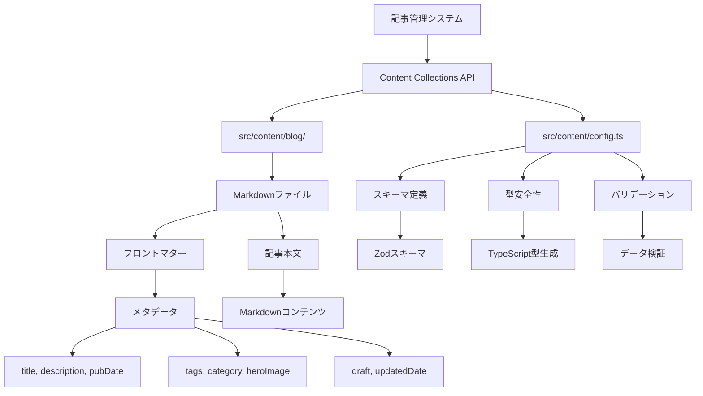

# 詳細設計書 - REQ-010: 記事管理機能

## 1. 概要

### 1.1 要件概要
- **要件ID**: REQ-010
- **要件名**: 記事管理機能
- **概要**: Markdownファイルベースの記事管理
- **優先度**: High
- **実装状況**: ✅ 完了

### 1.2 機能詳細
- `src/content/blog/`ディレクトリでの記事管理
- フロントマターによるメタデータ管理
- Content Collections APIによる型安全な記事データ処理
- 記事の追加・編集・削除

## 2. アーキテクチャ設計

### 2.1 システム構成図



### 2.2 データフロー

```
1. 記事作成
   ├─ Markdownファイル作成
   ├─ フロントマター設定
   └─ src/content/blog/に保存
   ↓
2. ビルド時処理
   ├─ Content Collections API読み込み
   ├─ Zodスキーマバリデーション
   └─ TypeScript型生成
   ↓
3. データ利用
   ├─ getCollection('blog')で取得
   ├─ 型安全なデータアクセス
   └─ 静的ページ生成
```

## 3. ファイル構造設計

### 3.1 ディレクトリ構造

```
src/content/
├── config.ts                    # Content Collections設定
└── blog/                       # ブログ記事ディレクトリ
    ├── first-post.md           # 記事ファイル例
    ├── typescript-best-practices.md
    ├── astro-blog-setup.md
    └── [article-slug].md       # 新規記事ファイル
```

### 3.2 命名規則

**ファイル名規則**:
```
記事ファイル名: [slug].md
  - スラッグ形式（kebab-case）
  - 英数字とハイフンのみ
  - 拡張子は .md

例:
  ✅ typescript-best-practices.md
  ✅ astro-blog-setup.md
  ✅ react-hooks-guide.md
  ❌ TypeScript Best Practices.md
  ❌ astro_blog_setup.md
```

## 4. Content Collections設計

### 4.1 スキーマ定義

**ファイルパス**: `src/content/config.ts`

```typescript
import { defineCollection, z } from 'astro:content';

const blog = defineCollection({
  type: 'content',
  schema: z.object({
    // 必須フィールド
    title: z.string(),                    // 記事タイトル
    description: z.string(),              // 記事説明（SEO用）
    pubDate: z.coerce.date(),            // 公開日
    tags: z.array(z.string()),           // タグ配列
    
    // 任意フィールド
    updatedDate: z.coerce.date().optional(), // 更新日
    heroImage: z.string().optional(),     // ヒーロー画像URL
    category: z.string().optional(),      // カテゴリ
    draft: z.boolean().default(false),   // 下書きフラグ
  }),
});

export const collections = { blog };
```

### 4.2 型定義生成

**自動生成される型**:
```typescript
// Astroが自動生成する型
type BlogEntry = CollectionEntry<'blog'>;

interface BlogData {
  title: string;
  description: string;
  pubDate: Date;
  tags: string[];
  updatedDate?: Date;
  heroImage?: string;
  category?: string;
  draft: boolean;
}

interface BlogEntry {
  id: string;          // ファイル名（拡張子なし）
  slug: string;        // URL用スラッグ
  body: string;        // Markdown本文
  collection: 'blog';  // コレクション名
  data: BlogData;      // フロントマターデータ
}
```

## 5. フロントマター設計

### 5.1 標準テンプレート

**新規記事テンプレート**:
```yaml
---
title: '記事のタイトル'
description: '記事の説明（SEO用、150文字以内推奨）'
pubDate: 2025-01-15
updatedDate: 2025-01-20
heroImage: 'https://example.com/hero-image.jpg'
tags: ['TypeScript', 'React', 'Web開発']
category: '技術'
draft: false
---
```

### 5.2 フィールド詳細仕様

#### 5.2.1 必須フィールド

**title (string)**:
```yaml
title: 'TypeScriptのベストプラクティス'
```
- 記事のタイトル
- SEOに重要（60文字以内推奨）
- HTML `<title>`タグに使用

**description (string)**:
```yaml
description: 'TypeScriptを使った開発でのベストプラクティスをまとめました。型安全性を保ちながら効率的な開発を行う方法を解説します。'
```
- 記事の説明文
- SEOディスクリプション（150-160文字推奨）
- メタタグ・OGPに使用

**pubDate (Date)**:
```yaml
pubDate: 2025-01-15
# または
pubDate: 2025-01-15T10:30:00+09:00
```
- 記事公開日
- YAML Date形式またはISO 8601形式
- 記事ソートの基準

**tags (string[])**:
```yaml
tags: ['TypeScript', 'JavaScript', 'プログラミング']
```
- 記事のタグ配列
- 分類・検索に使用
- 3-5個程度が推奨

#### 5.2.2 任意フィールド

**updatedDate (Date | undefined)**:
```yaml
updatedDate: 2025-01-20
```
- 記事更新日
- 設定時は pubDate より後の日付
- 更新があった際に設定

**heroImage (string | undefined)**:
```yaml
heroImage: 'https://images.unsplash.com/photo-example'
```
- 記事のヒーロー画像URL
- OGP画像としても使用
- アスペクト比 16:9 推奨

**category (string | undefined)**:
```yaml
category: '技術'
```
- 記事のカテゴリ
- 大分類として使用
- 例: '技術', '雑記', 'レビュー'

**draft (boolean)**:
```yaml
draft: true   # 下書き（本番非表示）
draft: false  # 公開記事（デフォルト）
```
- 下書きフラグ
- true時は本番環境で非表示
- デフォルト: false

## 6. 記事データ処理

### 6.1 データ取得API

**全記事取得**:
```typescript
import { getCollection } from 'astro:content';

// 全公開記事取得
const posts = await getCollection('blog', ({ data }) => {
  return data.draft !== true;
});

// 全記事取得（下書き含む）
const allPosts = await getCollection('blog');
```

**特定記事取得**:
```typescript
import { getEntry } from 'astro:content';

// スラッグで記事取得
const post = await getEntry('blog', 'typescript-best-practices');
```

### 6.2 データソート・フィルタリング

**日付順ソート**:
```typescript
// 最新記事順
const sortedPosts = posts.sort(
  (a, b) => b.data.pubDate.valueOf() - a.data.pubDate.valueOf()
);

// 更新日優先ソート
const sortedByUpdate = posts.sort((a, b) => {
  const aDate = a.data.updatedDate || a.data.pubDate;
  const bDate = b.data.updatedDate || b.data.pubDate;
  return bDate.valueOf() - aDate.valueOf();
});
```

**タグフィルタリング**:
```typescript
// 特定タグの記事取得
const taggedPosts = posts.filter(post => 
  post.data.tags.includes('TypeScript')
);

// 複数タグの記事取得
const multiTagPosts = posts.filter(post =>
  ['TypeScript', 'React'].some(tag => post.data.tags.includes(tag))
);
```

### 6.3 メタデータ処理

**読了時間計算**:
```typescript
import readingTime from 'reading-time';

const readTime = readingTime(post.body);
// => { text: "約3分", minutes: 3, time: 180000, words: 600 }
```

**日付フォーマット**:
```typescript
import { format } from 'date-fns';
import { ja } from 'date-fns/locale';

const formattedDate = format(post.data.pubDate, 'yyyy年MM月dd日', { 
  locale: ja 
});
```

## 7. 記事管理ワークフロー

### 7.1 新規記事作成

**手順**:
```bash
1. ファイル作成
   touch src/content/blog/new-article-slug.md

2. フロントマター記述
   ---
   title: '新しい記事のタイトル'
   description: '記事の説明'
   pubDate: 2025-01-15
   tags: ['タグ1', 'タグ2']
   draft: true  # 最初は下書き
   ---

3. 記事本文作成
   # 記事タイトル
   
   記事の内容...

4. 下書き解除
   draft: false
```

### 7.2 記事編集

**更新時の手順**:
```yaml
1. updatedDateを追加/更新
   updatedDate: 2025-01-20

2. 変更内容に応じてメタデータ更新
   - tags: 新しいタグ追加
   - description: 内容に合わせて更新
   - heroImage: 必要に応じて変更

3. 本文修正
4. ビルド・確認
```

### 7.3 記事削除

**削除手順**:
```bash
1. ファイル削除
   rm src/content/blog/article-to-delete.md

2. ビルド時に自動的にサイトから除外
3. 静的ファイル再生成
```

## 8. バリデーション設計

### 8.1 Zodスキーマバリデーション

**フロントマターチェック**:
```typescript
// ビルド時自動実行
const validation = blogSchema.safeParse(frontmatterData);

if (!validation.success) {
  // バリデーションエラー
  console.error('記事データエラー:', validation.error.issues);
  // ビルド停止
  process.exit(1);
}
```

**エラー例**:
```
ValidationError: [
  {
    "code": "invalid_type",
    "expected": "string",
    "received": "undefined",
    "path": ["title"],
    "message": "Required"
  },
  {
    "code": "invalid_date",
    "path": ["pubDate"],
    "message": "Invalid date"
  }
]
```

### 8.2 カスタムバリデーション

**日付検証**:
```typescript
const blogSchema = z.object({
  pubDate: z.coerce.date(),
  updatedDate: z.coerce.date().optional(),
}).refine((data) => {
  // updatedDateがある場合、pubDateより後である必要がある
  if (data.updatedDate) {
    return data.updatedDate >= data.pubDate;
  }
  return true;
}, {
  message: "更新日は公開日以降である必要があります",
  path: ["updatedDate"],
});
```

## 9. 型安全性設計

### 9.1 TypeScript統合

**型安全なデータアクセス**:
```typescript
import type { CollectionEntry } from 'astro:content';

// 型安全な記事データ
function processBlogPost(post: CollectionEntry<'blog'>) {
  // data.titleは string 型として認識
  const title: string = post.data.title;
  
  // data.updatedDateは Date | undefined 型として認識
  const updated: Date | undefined = post.data.updatedDate;
  
  // タグは string[] 型として認識
  const tags: string[] = post.data.tags;
}
```

**型ガードの活用**:
```typescript
// 下書きでない記事のみの型
type PublishedPost = CollectionEntry<'blog'> & {
  data: { draft: false }
};

function isPublished(post: CollectionEntry<'blog'>): post is PublishedPost {
  return !post.data.draft;
}

const publishedPosts = allPosts.filter(isPublished);
```

### 9.2 エディタサポート

**IntelliSense対応**:
```typescript
// フロントマターのオートコンプリート
const post = await getEntry('blog', 'example');

post.data.       // ここでフィールド候補が表示
//      ├─ title (string)
//      ├─ description (string)
//      ├─ pubDate (Date)
//      ├─ tags (string[])
//      └─ ...
```

## 10. パフォーマンス設計

### 10.1 ビルド時最適化

**静的生成**:
```typescript
// ビルド時に全記事を静的生成
export async function getStaticPaths() {
  const posts = await getCollection('blog', ({ data }) => !data.draft);
  
  return posts.map((post) => ({
    params: { slug: post.slug },
    props: { post },
  }));
}
```

**データキャッシュ**:
```typescript
// Astroが自動的にContent Collectionsをキャッシュ
// 変更されたファイルのみ再処理
```

### 10.2 メモリ使用量最適化

**遅延読み込み**:
```typescript
// 記事本文は必要時のみ読み込み
const postMeta = posts.map(post => ({
  slug: post.slug,
  data: post.data,
  // body は含めない（メモリ節約）
}));
```

## 11. SEO設計

### 11.1 メタデータ最適化

**自動メタタグ生成**:
```typescript
// 記事ページでの自動設定
const { title, description, heroImage, pubDate } = post.data;

const seoTitle = `${title} | Tech Blog`;
const seoDescription = description;
const seoImage = heroImage || '/default-og-image.jpg';
```

### 11.2 構造化データ

**Article Schema生成**:
```typescript
const articleSchema = {
  "@context": "https://schema.org",
  "@type": "Article",
  "headline": post.data.title,
  "description": post.data.description,
  "author": {
    "@type": "Person",
    "name": "ブログ著者名"
  },
  "datePublished": post.data.pubDate.toISOString(),
  "dateModified": (post.data.updatedDate || post.data.pubDate).toISOString(),
  "image": post.data.heroImage,
  "keywords": post.data.tags.join(', ')
};
```

## 12. 運用・保守設計

### 12.1 記事管理ツール（将来実装）

**CMS統合候補**:
```typescript
// Decap CMS (旧Netlify CMS) 統合例
// public/admin/config.yml
collections:
  - name: "blog"
    label: "Blog"
    folder: "src/content/blog"
    create: true
    slug: "{{slug}}"
    fields:
      - { label: "Title", name: "title", widget: "string" }
      - { label: "Description", name: "description", widget: "text" }
      - { label: "Publish Date", name: "pubDate", widget: "datetime" }
      - { label: "Tags", name: "tags", widget: "list" }
      - { label: "Body", name: "body", widget: "markdown" }
```

### 12.2 バックアップ戦略

**Git管理**:
```bash
# 記事ファイルはGitで管理
git add src/content/blog/
git commit -m "feat: 新記事追加 - TypeScriptベストプラクティス"
```

**自動バックアップ**:
```yaml
# GitHub Actions例
name: Backup Content
on:
  schedule:
    - cron: '0 2 * * *'  # 毎日2時に実行
jobs:
  backup:
    runs-on: ubuntu-latest
    steps:
      - uses: actions/checkout@v3
      - name: Create backup
        run: |
          tar -czf content-backup-$(date +%Y%m%d).tar.gz src/content/
```

## 13. 今後の拡張計画

### 13.1 記事管理機能拡張

**優先度High**:
1. **カテゴリ機能完全実装** - タグとの使い分け明確化
2. **記事テンプレート機能** - 技術記事、レビュー記事等のテンプレート
3. **記事ステータス管理** - 下書き以外のステータス（レビュー中等）

**優先度Medium**:
1. **記事バージョン管理** - 記事履歴の管理
2. **関連記事自動抽出** - タグベースの関連記事算出
3. **記事統計機能** - 文字数、更新頻度等の分析

### 13.2 開発者体験向上

**エディタ拡張**:
```json
// .vscode/settings.json
{
  "files.associations": {
    "*.md": "markdown"
  },
  "markdown.validate.enabled": true,
  "frontMatter.dashboard.openOnStart": true
}
```

**記事作成支援**:
```bash
# npm script例
npm run new-post "記事タイトル"
# => src/content/blog/記事タイトル.md を生成
```

### 13.3 外部CMS対応計画

#### 13.3.1 概要と背景

**対応方針**:
- 現在のMarkdownファイルベース管理から、将来的に外部CMSとの連携を可能にする
- コンテンツ管理の利便性向上とチーム編集機能の実現
- 現行システムとの互換性を保持した段階的移行

**想定対象CMS**:
1. **microCMS** - 日本語対応、豊富なAPI、管理画面の使いやすさ
2. **Contentful** - 国際的実績、豊富な機能、開発者ツール充実
3. **Strapi** - オープンソース、自社ホスティング可能
4. **Sanity** - リアルタイム更新、柔軟なスキーマ設計

#### 13.3.2 アーキテクチャ変更計画

**データソース切り替え設計**:
```typescript
// 将来的な実装イメージ
interface ContentSource {
  getCollection(collection: string): Promise<CollectionEntry[]>;
  getEntry(collection: string, id: string): Promise<CollectionEntry>;
}

class MarkdownContentSource implements ContentSource {
  // 現在の実装
}

class MicroCMSContentSource implements ContentSource {
  // 将来の外部CMS実装
}

// 設定による切り替え
const contentSource = process.env.CONTENT_SOURCE === 'cms' 
  ? new MicroCMSContentSource()
  : new MarkdownContentSource();
```

**ハイブリッド運用**:
```typescript
// 複数ソースからのコンテンツ統合
async function getUnifiedCollection(collection: string) {
  const markdownPosts = await getCollection(collection);
  const cmsPosts = await fetchFromCMS(collection);
  
  return [...markdownPosts, ...cmsPosts]
    .sort((a, b) => b.data.pubDate.valueOf() - a.data.pubDate.valueOf());
}
```

#### 13.3.3 段階的移行計画

**Phase 1: 基盤整備**（将来実装）
- Content Collectionsのアダプター化
- CMS統合用のAPIクライアント開発
- データスキーマの標準化

**Phase 2: ハイブリッド運用**（将来実装）
- 既存Markdownファイルと外部CMSの併存
- 編集者向けCMS管理画面の導入
- 記事ごとのソース管理機能

**Phase 3: 完全移行**（将来実装）
- 全記事の外部CMS移行
- Markdownファイルのバックアップ保持
- レガシーコンテンツの互換性維持

#### 13.3.4 技術的考慮事項

**スキーマ互換性**:
```typescript
// 現在のZodスキーマとCMSスキーマの対応
const blogSchemaMapping = {
  title: 'タイトル',           // microCMS: textField
  description: '説明',         // microCMS: textareaField  
  pubDate: '公開日',          // microCMS: dateField
  heroImage: 'ヒーロー画像',   // microCMS: mediaField
  tags: 'タグ',              // microCMS: multipleSelectField
  category: 'カテゴリ',       // microCMS: selectField
  draft: '下書き',           // microCMS: booleanField
};
```

**ビルド時統合**:
```typescript
// Astroビルド時のCMSデータ取得
export async function getStaticPaths() {
  // 環境変数に基づくデータソース切り替え
  const posts = process.env.USE_CMS 
    ? await fetchFromMicroCMS()
    : await getCollection('blog');
    
  return posts.map(post => ({
    params: { slug: post.slug },
    props: { post }
  }));
}
```

**キャッシュ戦略**:
```typescript
// CMSデータのキャッシュ機能
class CMSCache {
  private cache = new Map();
  private ttl = 5 * 60 * 1000; // 5分
  
  async get(key: string) {
    const cached = this.cache.get(key);
    if (cached && Date.now() - cached.timestamp < this.ttl) {
      return cached.data;
    }
    return null;
  }
}
```

#### 13.3.5 運用面での考慮事項

**編集フロー**:
- 技術記事: 引き続きMarkdown + Git管理（開発者向け）
- 一般記事: CMS管理画面での編集（非技術者向け）
- プレビュー機能: 両方式での確認機能

**コンテンツ管理ポリシー**:
- 重要記事のバックアップ必須
- CMS障害時のフォールバック機能
- 記事移行時のURL互換性保持

**セキュリティ**:
- CMS APIキーの安全な管理
- ビルド時のみのAPI呼び出し（静的サイト維持）
- 不正コンテンツの検証機能

#### 13.3.6 実装見積もり

**開発工数見積もり**（将来対応時）:
```
Phase 1: 基盤整備
- CMSアダプター開発: 5-8日
- スキーママッピング: 2-3日
- テスト環境構築: 3-5日

Phase 2: ハイブリッド運用
- 統合機能開発: 8-12日
- 管理画面設定: 3-5日
- 運用テスト: 5-7日

Phase 3: 完全移行
- データ移行ツール: 5-8日
- 検証・調整: 10-15日
- ドキュメント整備: 3-5日

合計見積もり: 44-68日
```

**維持コスト**（月額見積もり）:
- microCMS Basic: ¥9,800/月
- 画像配信・CDN: ¥2,000-5,000/月
- 開発・運用工数: 5-10時間/月

---

**文書作成日**: 2025-01-15  
**最終更新日**: 2025-01-29  
**作成者**: システム設計書自動生成  
**バージョン**: 1.1  
**関連文書**: 10-requirements.md, 20-basic-design.md, 30-todo-list.md