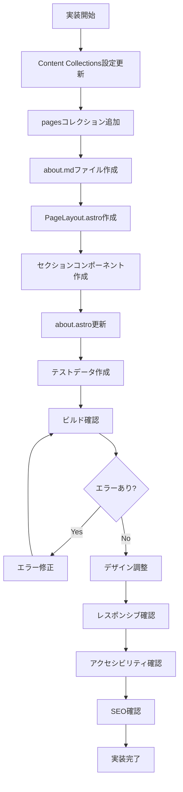

# 詳細設計書 - REQ-011: Aboutページマークダウン管理機能

## 1. 概要

### 1.1 要件概要
- **要件ID**: REQ-011
- **要件名**: Aboutページマークダウン管理機能
- **概要**: Aboutページのマークダウンベース管理機能
- **優先度**: Medium
- **実装状況**: ❌ 未実装

### 1.2 機能詳細
- ブログ記事とは独立したMarkdownファイルでのコンテンツ管理
- `src/content/pages/`ディレクトリでのページ管理
- Content Collections APIによる型安全なページデータ処理
- プロフィール、スキル、経歴等の構造化データ対応
- 専用レイアウトでの表示最適化

### 1.3 背景・目的

#### 1.3.1 現状の課題
- **ハードコーディング**: 現在のAboutページは`src/pages/about.astro`に直接HTMLで記述
- **保守性の問題**: コンテンツ更新時にコードを直接編集する必要
- **構造化の不足**: プロフィール、スキル、経歴等のデータが非構造化
- **一貫性の欠如**: ブログ記事とのコンテンツ管理方法が異なる

#### 1.3.2 期待効果
- **コンテンツとコードの分離**: Markdownファイルでのコンテンツ管理
- **保守性向上**: 技術者以外でもコンテンツ更新が可能
- **データ構造化**: 型安全なデータ管理とバリデーション
- **管理の一元化**: ブログ記事と同様のContent Collections管理

## 2. アーキテクチャ設計

### 2.1 システム構成図

```
┌─────────────────────────────────────────────────────────────┐
│                 Aboutページ管理システム                     │
├─────────────────────────────────────────────────────────────┤
│  ┌───────────────┐  ┌─────────────────┐  ┌───────────────┐  │
│  │  about.astro  │  │  PageLayout.astro│  │ pages Collection│  │
│  │ (ルーティング) │  │   (レイアウト)   │  │ (データソース) │  │
│  └───────────────┘  └─────────────────┘  └───────────────┘  │
├─────────────────────────────────────────────────────────────┤
│  ┌───────────────┐  ┌─────────────────┐  ┌───────────────┐  │
│  │ ProfileSection│  │  SkillsSection  │  │ ExperienceSection│ │
│  │  (プロフィール)│  │   (スキル)      │  │    (経歴)     │  │
│  └───────────────┘  └─────────────────┘  └───────────────┘  │
├─────────────────────────────────────────────────────────────┤
│  ┌───────────────┐  ┌─────────────────┐  ┌───────────────┐  │
│  │   Markdown    │  │  Content        │  │  TailwindCSS  │  │
│  │   (コンテンツ)  │  │  Collections    │  │ (スタイリング) │  │
│  └───────────────┘  └─────────────────┘  └───────────────┘  │
└─────────────────────────────────────────────────────────────┘
```

### 2.2 データフロー

```
1. URL Request (/about/)
   ↓
2. getStaticProps() - pagesコレクション取得
   ↓
3. Content Collections - "about"ページデータ取得
   ↓
4. PageLayout.astro - ページレイアウト適用
   ↓
5. 並列処理:
   ├─ page.render() - Markdown → HTML変換
   ├─ スキルデータ構造化
   ├─ 経歴データ構造化
   └─ プロフィール画像最適化
   ↓
6. セクション別コンポーネント描画
   ↓
7. HTML出力
```

### 2.3 ディレクトリ構造

```
src/
├── content/
│   ├── pages/                   # 新規追加
│   │   ├── about.md            # Aboutページコンテンツ
│   │   └── (future: contact.md, privacy.md)
│   ├── blog/                   # 既存
│   └── config.ts               # 設定更新
├── layouts/
│   ├── PageLayout.astro        # 新規追加
│   ├── BaseLayout.astro        # 既存
│   └── BlogLayout.astro        # 既存
├── components/
│   ├── react/                  # 既存
│   └── page/                   # 新規追加
│       ├── ProfileSection.astro
│       ├── SkillsSection.astro
│       └── ExperienceSection.astro
└── pages/
    ├── about.astro             # 既存（大幅変更）
    └── ...
```

## 3. データモデル設計

### 3.1 Pages Collection スキーマ

```typescript
// src/content/config.ts (更新)
import { defineCollection, z } from 'astro:content';

// スキルレベル定義
const SkillLevel = z.union([
  z.literal(1), z.literal(2), z.literal(3), 
  z.literal(4), z.literal(5)
]);

// スキルカテゴリ定義
const SkillCategory = z.union([
  z.literal('frontend'),
  z.literal('backend'), 
  z.literal('database'),
  z.literal('infrastructure'),
  z.literal('tools'),
  z.literal('other')
]);

// 経歴タイプ定義
const ExperienceType = z.union([
  z.literal('work'),      // 職歴
  z.literal('education'), // 学歴
  z.literal('project'),   // プロジェクト
  z.literal('certification') // 資格
]);

const pages = defineCollection({
  type: 'content',
  schema: z.object({
    // 基本情報
    title: z.string(),
    description: z.string(),
    lastUpdated: z.coerce.date(),
    
    // プロフィール情報
    profile: z.object({
      name: z.string(),
      role: z.string(),
      location: z.string().optional(),
      avatar: z.string().optional(),
      bio: z.string(),
      greeting: z.string()
    }),
    
    // スキル情報
    skills: z.array(z.object({
      name: z.string(),
      category: SkillCategory,
      level: SkillLevel,
      description: z.string().optional(),
      icon: z.string().optional(),
      color: z.string().optional()
    })),
    
    // 経歴情報
    experiences: z.array(z.object({
      type: ExperienceType,
      title: z.string(),
      organization: z.string(),
      location: z.string().optional(),
      startDate: z.coerce.date(),
      endDate: z.coerce.date().optional(),
      current: z.boolean().default(false),
      description: z.string(),
      technologies: z.array(z.string()).optional(),
      achievements: z.array(z.string()).optional()
    })),
    
    // ソーシャルリンク
    social: z.object({
      github: z.string().url().optional(),
      twitter: z.string().url().optional(),
      linkedin: z.string().url().optional(),
      email: z.string().email().optional(),
      website: z.string().url().optional()
    }).optional(),
    
    // SEO設定
    seo: z.object({
      metaTitle: z.string().optional(),
      metaDescription: z.string().optional(),
      ogImage: z.string().optional()
    }).optional()
  })
});

// 既存のblogコレクションと統合
const blog = defineCollection({
  // 既存のスキーマ
});

export const collections = { 
  blog, 
  pages // 新規追加
};
```

### 3.2 Markdownファイル例

```markdown
---
# src/content/pages/about.md
title: "About Me"
description: "エンジニアとしての経歴、スキル、実績について紹介します。"
lastUpdated: 2025-01-29

# プロフィール情報
profile:
  name: "山田太郎"
  role: "フルスタックエンジニア"
  location: "東京, 日本"
  avatar: "/images/profile.jpg"
  bio: "5年以上のWeb開発経験を持つフルスタックエンジニア。モダンなフロントエンド技術からバックエンド、インフラまで幅広く対応。"
  greeting: "こんにちは！Tech Blogの管理人です。"

# スキル情報
skills:
  - name: "React"
    category: "frontend"
    level: 4
    description: "Hooks、Context APIを含む現代的なReact開発"
    icon: "react"
    color: "#61DAFB"
  
  - name: "TypeScript"
    category: "frontend"
    level: 4
    description: "型安全な開発とジェネリクスの活用"
    icon: "typescript"
    color: "#3178C6"
  
  - name: "Node.js"
    category: "backend"
    level: 4
    description: "Express、Fastifyを使ったAPI開発"
    icon: "nodejs"
    color: "#339933"
  
  - name: "PostgreSQL"
    category: "database"
    level: 3
    description: "リレーショナルデータベース設計と最適化"
    icon: "postgresql"
    color: "#336791"

# 経歴情報
experiences:
  - type: "work"
    title: "シニアフロントエンドエンジニア"
    organization: "テック株式会社"
    location: "東京"
    startDate: 2022-04-01
    current: true
    description: |
      ECサイトのフロントエンド開発をリード。React/TypeScriptを使用した
      SPA開発、パフォーマンス最適化、アクセシビリティ対応を担当。
    technologies: ["React", "TypeScript", "Next.js", "Tailwind CSS"]
    achievements:
      - "ページ表示速度を40%改善"
      - "アクセシビリティスコアをAA準拠レベルまで向上"
      - "チーム内のTypeScript導入を推進"
  
  - type: "work"
    title: "フルスタックエンジニア"
    organization: "スタートアップ合同会社"
    location: "リモート"
    startDate: 2020-06-01
    endDate: 2022-03-31
    description: |
      BtoBサービスのフルスタック開発。フロントエンドからバックエンド、
      インフラまで一貫して担当。
    technologies: ["Vue.js", "Node.js", "Express", "MySQL", "AWS"]
    achievements:
      - "MVP開発を3ヶ月で完成"
      - "ユーザー数0から1000人まで拡大をサポート"

# ソーシャルリンク
social:
  github: "https://github.com/username"
  twitter: "https://twitter.com/username"
  email: "hello@example.com"

# SEO設定
seo:
  metaTitle: "About - 山田太郎 | Tech Blog"
  metaDescription: "フルスタックエンジニア山田太郎の経歴、スキル、実績について詳しく紹介します。"
  ogImage: "/images/about-og.jpg"
---

## はじめに

こんにちは！私は5年以上のWeb開発経験を持つフルスタックエンジニアです。
このブログでは、日々の学習や実務で得た知識、技術的な発見を共有しています。

## 私について

技術は日々進歩していますが、基礎をしっかりと理解し、新しい技術にも
チャレンジしていくことを大切にしています。

### 開発哲学

- **ユーザーファースト**: 常にエンドユーザーの視点を意識した開発
- **品質重視**: テスト駆動開発とコードレビューの徹底
- **継続学習**: 新しい技術への好奇心と学習意欲
- **チームワーク**: 知識共有とメンタリングの重視

## 今後の目標

- より高度なパフォーマンス最適化技術の習得
- AI/ML分野への知識拡大
- OSS活動への積極的参加
- 技術コミュニティでの発表活動

---

このブログが、同じ道を歩む方々の参考になれば幸いです。
```

## 4. コンポーネント設計

### 4.1 主要コンポーネント

#### 4.1.1 about.astro (更新版)

**ファイルパス**: `src/pages/about.astro`

**責務**:
- pagesコレクションからAboutデータの取得
- PageLayoutへのデータ受け渡し

**実装例**:
```typescript
---
// src/pages/about.astro
import { getEntry } from 'astro:content';
import PageLayout from '../layouts/PageLayout.astro';

// Aboutページデータ取得
const aboutPage = await getEntry('pages', 'about');

if (!aboutPage) {
  throw new Error('About page not found');
}

const { data, render } = aboutPage;
const { Content } = await render();
---

<PageLayout pageData={data}>
  <Content />
</PageLayout>
```

#### 4.1.2 PageLayout.astro (新規作成)

**ファイルパス**: `src/layouts/PageLayout.astro`

**責務**:
- ページ共通レイアウトの提供
- SEO設定の適用
- セクション別コンポーネントの配置

**Props Interface**:
```typescript
import type { CollectionEntry } from 'astro:content';

export interface Props {
  pageData: CollectionEntry<'pages'>['data'];
}
```

**レイアウト構造**:
```astro
---
// src/layouts/PageLayout.astro
import BaseLayout from './BaseLayout.astro';
import Header from '../components/react/Header.tsx';
import Footer from '../components/react/Footer.tsx';
import ProfileSection from '../components/page/ProfileSection.astro';
import SkillsSection from '../components/page/SkillsSection.astro';
import ExperienceSection from '../components/page/ExperienceSection.astro';

import { createPageTitle, createCanonicalUrl } from '../config/site.ts';

export interface Props {
  pageData: CollectionEntry<'pages'>['data'];
}

const { pageData } = Astro.props;
const currentPath = Astro.url.pathname;

// SEO設定
const title = pageData.seo?.metaTitle || createPageTitle(pageData.title);
const description = pageData.seo?.metaDescription || pageData.description;
const ogImage = pageData.seo?.ogImage;
---

<BaseLayout 
  title={title}
  description={description}
  ogImage={ogImage}
  canonicalUrl={createCanonicalUrl(currentPath)}
>
  <div class="min-h-screen flex flex-col">
    <Header currentPath={currentPath} client:load />
    
    <main class="flex-1">
      <!-- プロフィールセクション -->
      <ProfileSection profile={pageData.profile} />
      
      <!-- メインコンテンツ -->
      <div class="max-w-4xl mx-auto px-4 sm:px-6 lg:px-8 py-12">
        <!-- マークダウンコンテンツ -->
        <section class="prose prose-lg dark:prose-invert max-w-none mb-16">
          <slot />
        </section>
        
        <!-- スキルセクション -->
        <SkillsSection skills={pageData.skills} />
        
        <!-- 経歴セクション -->
        <ExperienceSection experiences={pageData.experiences} />
        
        <!-- ソーシャルリンク -->
        {pageData.social && (
          <section class="mt-16 text-center">
            <h2 class="text-2xl font-bold mb-8">Connect with me</h2>
            <!-- ソーシャルリンク実装 -->
          </section>
        )}
      </div>
    </main>
    
    <Footer />
  </div>
</BaseLayout>
```

#### 4.1.3 ProfileSection.astro (新規作成)

**ファイルパス**: `src/components/page/ProfileSection.astro`

**責務**:
- プロフィール情報の表示
- アバター画像の最適化
- ヒーローセクションの構築

**実装例**:
```astro
---
// src/components/page/ProfileSection.astro
import { Image } from 'astro:assets';

export interface Props {
  profile: {
    name: string;
    role: string;
    location?: string;
    avatar?: string;
    bio: string;
    greeting: string;
  };
}

const { profile } = Astro.props;
---

<section class="bg-gradient-to-br from-gray-50 to-gray-100 dark:from-gray-900 dark:to-gray-800 py-16">
  <div class="max-w-4xl mx-auto px-4 sm:px-6 lg:px-8">
    <div class="text-center">
      <!-- アバター画像 -->
      {profile.avatar && (
        <div class="mb-8">
          <Image
            src={profile.avatar}
            alt={`${profile.name}のプロフィール画像`}
            width={128}
            height={128}
            class="w-32 h-32 rounded-full mx-auto object-cover border-4 border-white dark:border-gray-700 shadow-lg"
          />
        </div>
      )}
      
      <!-- 名前・役職 -->
      <h1 class="text-4xl lg:text-5xl font-bold text-gray-900 dark:text-white mb-4">
        {profile.name}
      </h1>
      
      <p class="text-xl text-blue-600 dark:text-blue-400 font-semibold mb-2">
        {profile.role}
      </p>
      
      {profile.location && (
        <p class="text-gray-600 dark:text-gray-400 mb-6">
          📍 {profile.location}
        </p>
      )}
      
      <!-- 挨拶文 -->
      <p class="text-xl text-gray-600 dark:text-gray-300 mb-6">
        {profile.greeting}
      </p>
      
      <!-- 自己紹介 -->
      <div class="max-w-3xl mx-auto">
        <p class="text-lg text-gray-700 dark:text-gray-300 leading-relaxed">
          {profile.bio}
        </p>
      </div>
    </div>
  </div>
</section>
```

#### 4.1.4 SkillsSection.astro (新規作成)

**ファイルパス**: `src/components/page/SkillsSection.astro`

**責務**:
- スキル情報の構造化表示
- カテゴリ別グループ化
- スキルレベルの視覚化

**実装例**:
```astro
---
// src/components/page/SkillsSection.astro
export interface Skill {
  name: string;
  category: 'frontend' | 'backend' | 'database' | 'infrastructure' | 'tools' | 'other';
  level: 1 | 2 | 3 | 4 | 5;
  description?: string;
  icon?: string;
  color?: string;
}

export interface Props {
  skills: Skill[];
}

const { skills } = Astro.props;

// カテゴリ別グループ化
const skillsByCategory = skills.reduce((acc, skill) => {
  if (!acc[skill.category]) {
    acc[skill.category] = [];
  }
  acc[skill.category].push(skill);
  return acc;
}, {} as Record<string, Skill[]>);

// カテゴリ表示名
const categoryNames = {
  frontend: 'フロントエンド',
  backend: 'バックエンド',
  database: 'データベース',
  infrastructure: 'インフラ',
  tools: 'ツール',
  other: 'その他'
};

// カテゴリアイコン
const categoryIcons = {
  frontend: 'monitor',
  backend: 'server',
  database: 'database',
  infrastructure: 'cloud',
  tools: 'tool',
  other: 'package'
};
---

<section class="mb-16">
  <h2 class="text-3xl font-bold text-gray-900 dark:text-white mb-8 text-center">
    スキル・技術スタック
  </h2>
  
  <div class="grid grid-cols-1 md:grid-cols-2 lg:grid-cols-3 gap-6">
    {Object.entries(skillsByCategory).map(([category, categorySkills]) => (
      <div class="bg-white dark:bg-gray-800 rounded-lg p-6 border border-gray-200 dark:border-gray-700">
        <!-- カテゴリヘッダー -->
        <h3 class="text-xl font-semibold text-gray-900 dark:text-white mb-4 flex items-center">
          <span class="text-2xl mr-2">
            {/* カテゴリアイコン */}
          </span>
          {categoryNames[category as keyof typeof categoryNames]}
        </h3>
        
        <!-- スキル一覧 -->
        <div class="space-y-4">
          {categorySkills.map(skill => (
            <div>
              <!-- スキル名とレベル -->
              <div class="flex items-center justify-between mb-2">
                <span class="text-gray-700 dark:text-gray-300 font-medium">
                  {skill.name}
                </span>
                
                <!-- レベル表示（5段階） -->
                <div class="flex space-x-1">
                  {Array.from({ length: 5 }, (_, i) => (
                    <div
                      class={`w-2 h-2 rounded-full ${
                        i < skill.level 
                          ? 'bg-blue-500' 
                          : 'bg-gray-300 dark:bg-gray-600'
                      }`}
                    />
                  ))}
                </div>
              </div>
              
              <!-- スキル説明 -->
              {skill.description && (
                <p class="text-sm text-gray-600 dark:text-gray-400">
                  {skill.description}
                </p>
              )}
            </div>
          ))}
        </div>
      </div>
    ))}
  </div>
</section>
```

#### 4.1.5 ExperienceSection.astro (新規作成)

**ファイルパス**: `src/components/page/ExperienceSection.astro`

**責務**:
- 経歴情報の時系列表示
- 職歴・学歴・プロジェクト・資格の分類表示
- 技術スタック・実績の構造化表示

**実装例**:
```astro
---
// src/components/page/ExperienceSection.astro
import { format } from 'date-fns';
import { ja } from 'date-fns/locale';

export interface Experience {
  type: 'work' | 'education' | 'project' | 'certification';
  title: string;
  organization: string;
  location?: string;
  startDate: Date;
  endDate?: Date;
  current: boolean;
  description: string;
  technologies?: string[];
  achievements?: string[];
}

export interface Props {
  experiences: Experience[];
}

const { experiences } = Astro.props;

// 日付順でソート（新しい順）
const sortedExperiences = experiences.sort((a, b) => 
  new Date(b.startDate).getTime() - new Date(a.startDate).getTime()
);

// タイプ別アイコン
const typeIcons = {
  work: '💼',
  education: '🎓',
  project: '📂',
  certification: '📜'
};

// タイプ別表示名
const typeNames = {
  work: '職歴',
  education: '学歴', 
  project: 'プロジェクト',
  certification: '資格・認定'
};

// 日付フォーマット関数
const formatDate = (date: Date) => format(date, 'yyyy年MM月', { locale: ja });
---

<section class="mb-16">
  <h2 class="text-3xl font-bold text-gray-900 dark:text-white mb-8 text-center">
    経歴・実績
  </h2>
  
  <!-- タイムライン形式 -->
  <div class="relative">
    <!-- 中央線 -->
    <div class="absolute left-8 top-0 bottom-0 w-0.5 bg-gray-300 dark:bg-gray-600"></div>
    
    <div class="space-y-8">
      {sortedExperiences.map((exp, index) => (
        <div class="relative flex items-start">
          <!-- タイムラインドット -->
          <div class="flex-shrink-0 w-16 h-16 bg-white dark:bg-gray-800 border-4 border-blue-500 rounded-full flex items-center justify-center text-2xl relative z-10">
            {typeIcons[exp.type]}
          </div>
          
          <!-- コンテンツカード -->
          <div class="ml-6 flex-1">
            <div class="bg-white dark:bg-gray-800 rounded-lg p-6 border border-gray-200 dark:border-gray-700 shadow-sm">
              <!-- ヘッダー情報 -->
              <div class="mb-4">
                <div class="flex items-center justify-between mb-2">
                  <h3 class="text-xl font-semibold text-gray-900 dark:text-white">
                    {exp.title}
                  </h3>
                  <span class="text-sm text-blue-600 dark:text-blue-400 font-medium">
                    {typeNames[exp.type]}
                  </span>
                </div>
                
                <p class="text-lg text-gray-700 dark:text-gray-300 mb-2">
                  {exp.organization}
                  {exp.location && (
                    <span class="text-gray-500 dark:text-gray-400"> • {exp.location}</span>
                  )}
                </p>
                
                <!-- 期間 -->
                <p class="text-sm text-gray-600 dark:text-gray-400">
                  {formatDate(exp.startDate)} - {
                    exp.current 
                      ? '現在' 
                      : exp.endDate 
                        ? formatDate(exp.endDate)
                        : '継続中'
                  }
                </p>
              </div>
              
              <!-- 説明 -->
              <div class="mb-4">
                <p class="text-gray-700 dark:text-gray-300 leading-relaxed whitespace-pre-line">
                  {exp.description}
                </p>
              </div>
              
              <!-- 技術スタック -->
              {exp.technologies && exp.technologies.length > 0 && (
                <div class="mb-4">
                  <h4 class="text-sm font-semibold text-gray-900 dark:text-white mb-2">
                    使用技術:
                  </h4>
                  <div class="flex flex-wrap gap-2">
                    {exp.technologies.map(tech => (
                      <span class="px-2 py-1 bg-blue-100 dark:bg-blue-900 text-blue-800 dark:text-blue-200 text-sm rounded">
                        {tech}
                      </span>
                    ))}
                  </div>
                </div>
              )}
              
              <!-- 実績・成果 -->
              {exp.achievements && exp.achievements.length > 0 && (
                <div>
                  <h4 class="text-sm font-semibold text-gray-900 dark:text-white mb-2">
                    主な実績:
                  </h4>
                  <ul class="list-disc list-inside space-y-1">
                    {exp.achievements.map(achievement => (
                      <li class="text-gray-700 dark:text-gray-300 text-sm">
                        {achievement}
                      </li>
                    ))}
                  </ul>
                </div>
              )}
            </div>
          </div>
        </div>
      ))}
    </div>
  </div>
</section>
```

## 5. 実装フローチャート



## 6. 実装手順

### 6.1 Phase 1: 基盤準備
1. **Content Collections設定更新**
   - `src/content/config.ts`にpagesコレクション追加
   - スキーマ定義の実装

2. **ディレクトリ構造作成**
   ```bash
   mkdir src/content/pages
   mkdir src/components/page
   ```

3. **about.mdファイル作成**
   - `src/content/pages/about.md`にサンプルデータ作成

### 6.2 Phase 2: レイアウト実装
1. **PageLayout.astro作成**
   - ベースレイアウトの実装
   - SEO設定の統合

2. **セクションコンポーネント作成**
   - ProfileSection.astro
   - SkillsSection.astro  
   - ExperienceSection.astro

### 6.3 Phase 3: ページ統合
1. **about.astro更新**
   - 既存の静的実装を削除
   - Content Collections連携実装

2. **型安全性確認**
   - TypeScript型エラーの解決
   - Content Collections型の活用

### 6.4 Phase 4: 品質保証
1. **機能テスト**
   - データ表示の確認
   - レスポンシブ対応確認

2. **パフォーマンステスト**
   - ビルド時間への影響確認
   - 画像最適化の動作確認

## 7. 設定例・サンプルコード

### 7.1 最小構成のabout.md

```markdown
---
title: "About"
description: "私について"
lastUpdated: 2025-01-29

profile:
  name: "Tech Blogger"
  role: "エンジニア"
  bio: "技術について書いています。"
  greeting: "こんにちは！"

skills:
  - name: "JavaScript"
    category: "frontend"
    level: 4

experiences:
  - type: "work"
    title: "エンジニア"
    organization: "テック会社"
    startDate: 2023-01-01
    current: true
    description: "Webアプリケーション開発"
---

## 自己紹介

よろしくお願いします。
```

### 7.2 段階的移行戦略

```typescript
// about.astro (移行段階での実装例)
---
import { getEntry } from 'astro:content';
import BaseLayout from '../layouts/BaseLayout.astro';

// 段階的移行: データがあればContent Collections、なければ従来の実装
let aboutPage;
try {
  aboutPage = await getEntry('pages', 'about');
} catch (e) {
  console.warn('About page not found in Content Collections, using fallback');
}

const useLegacyLayout = !aboutPage;
---

{useLegacyLayout ? (
  <!-- 既存の静的実装 -->
  <BaseLayout title="About">
    <!-- 従来のHTMLコンテンツ -->
  </BaseLayout>
) : (
  <!-- 新しいContent Collections実装 -->
  <PageLayout pageData={aboutPage.data}>
    <Content />
  </PageLayout>
)}
```

## 8. テスト計画

### 8.1 単体テスト
- **Content Collections スキーマ検証**
  - 必須フィールドの確認
  - 型制約の確認
  - デフォルト値の動作確認

- **コンポーネント単体テスト**
  - 各セクションコンポーネントの描画確認
  - Props渡しの確認
  - エラーハンドリングの確認

### 8.2 統合テスト  
- **ページ全体表示テスト**
  - about.mdのデータが正しく表示されるか
  - SEO設定が適用されるか
  - レスポンシブデザインが機能するか

- **ビルドテスト**
  - 静的サイト生成の成功確認
  - 画像最適化の動作確認
  - TypeScript型エラーがないか

### 8.3 ユーザビリティテスト
- **アクセシビリティ確認**
  - スクリーンリーダー対応
  - キーボードナビゲーション
  - コントラスト比の確認

- **パフォーマンステスト**
  - Core Web Vitals測定
  - 画像読み込み最適化確認

## 9. 運用・保守について

### 9.1 コンテンツ更新手順

1. **プロフィール情報更新**
   ```bash
   # about.mdのprofileセクションを編集
   vim src/content/pages/about.md
   
   # ビルドして確認
   npm run build
   npm run preview
   ```

2. **スキル情報追加**
   ```markdown
   # 新しいスキルをskills配列に追加
   skills:
     - name: "新しい技術"
       category: "frontend"
       level: 3
       description: "学習中の技術"
   ```

3. **経歴情報更新**
   ```markdown
   # 新しい経歴をexperiences配列に追加
   experiences:
     - type: "work"
       title: "新しい役職"
       organization: "新しい会社"
       startDate: 2025-01-01
       current: true
       description: "新しい業務内容"
   ```

### 9.2 保守時の注意点

- **スキーマ変更時の影響**
  - Content Collections スキーマ変更時は既存データとの互換性を確認
  - 段階的移行によるゼロダウンタイム更新

- **画像管理**
  - プロフィール画像は`public/images/`ディレクトリに配置
  - Astro Imageコンポーネントによる最適化を活用

- **SEO設定**
  - ページ更新時はlastUpdatedを更新
  - metaDescriptionはページ内容に合わせて調整

### 9.3 トラブルシューティング

- **ビルドエラー時の対処**
  ```bash
  # 型エラー確認
  npm run astro check
  
  # Content Collections再生成
  rm -rf .astro && npm run dev
  ```

- **データ表示されない場合**
  - about.mdのフロントマター形式確認
  - Content Collectionsスキーマとの整合性確認

## 10. 今後の拡張予定

### 10.1 短期的拡張
- **他のページへの適用**
  - contact.md、privacy.mdの追加
  - 共通ページコンポーネントの整備

- **UI/UX改善**
  - アニメーション効果の追加
  - ダークモード対応の強化

### 10.2 長期的拡張
- **多言語対応**
  - i18n Content Collections対応
  - 言語別ページ管理

- **動的要素追加**
  - スキルレベルのプログレスバーアニメーション
  - 経歴のインタラクティブタイムライン

---

**文書作成日**: 2025-01-29  
**作成者**: システム設計チーム  
**バージョン**: 1.0  
**関連文書**: 
- 10-requirements.md (REQ-011)
- 30-todo-list.md (TASK-050)
- 40-detail-design-REQ-010.md (参考) 