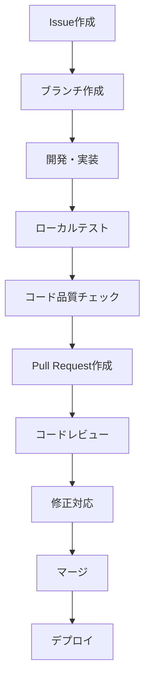

# 開発者ガイド

## 1. 概要

このドキュメントでは、Tech Blog (astoro-tech-blog) プロジェクトの開発に関するガイドラインを説明します。

### 1.1 対象読者
- 新規開発者
- コントリビューター
- メンテナー

### 1.2 技術スタック
- **フレームワーク**: Astro 5.x + React 19.x
- **言語**: TypeScript 5.x (strict mode)
- **スタイリング**: TailwindCSS 3.x
- **検索**: astro-pagefind
- **ツール**: ESLint, Prettier, Vite

## 2. ローカル開発環境セットアップ

### 2.1 必要環境

```bash
# Node.js 18以上
node --version  # v18.0.0+
npm --version   # v9.0.0+

# Git
git --version  # v2.0.0+
```

### 2.2 プロジェクトセットアップ

```bash
# リポジトリのクローン
git clone [repository-url]
cd astoro-tech-blog

# 依存関係のインストール
npm install

# 開発サーバー起動
npm run dev
```

### 2.3 IDE設定

#### 2.3.1 VS Code推奨拡張機能

```json
// .vscode/extensions.json
{
  "recommendations": [
    "astro-build.astro-vscode",
    "bradlc.vscode-tailwindcss",
    "esbenp.prettier-vscode",
    "dbaeumer.vscode-eslint",
    "ms-vscode.vscode-typescript-next"
  ]
}
```

#### 2.3.2 VS Code設定

```json
// .vscode/settings.json
{
  "editor.formatOnSave": true,
  "editor.defaultFormatter": "esbenp.prettier-vscode",
  "editor.codeActionsOnSave": {
    "source.fixAll.eslint": true
  },
  "files.associations": {
    "*.astro": "astro"
  },
  "emmet.includeLanguages": {
    "astro": "html"
  }
}
```

### 2.4 環境変数設定

```bash
# .env.local ファイルの作成
SITE_URL=http://localhost:4321
SITE_TITLE=Tech Blog
SITE_DESCRIPTION=技術ブログサイト
```

## 3. プロジェクト構造

### 3.1 ディレクトリ構造

```
src/
├── components/           # コンポーネント
│   ├── react/           # Reactコンポーネント
│   │   ├── BlogCard.tsx
│   │   ├── Header.tsx
│   │   ├── Navigation.tsx
│   │   ├── ThemeToggle.tsx
│   │   └── ...
│   └── SearchBox.astro  # Astroコンポーネント
├── content/             # コンテンツ
│   ├── blog/           # ブログ記事
│   └── config.ts       # Content Collections設定
├── layouts/            # レイアウト
│   ├── BaseLayout.astro
│   └── BlogLayout.astro
├── pages/              # ページ（ルーティング）
│   ├── blog/
│   ├── tags/
│   └── index.astro
├── styles/             # グローバルスタイル
│   └── global.css
└── assets/             # 静的アセット
    └── images/
```

### 3.2 命名規則

#### 3.2.1 ファイル・ディレクトリ

```
# ケバブケース（小文字、ハイフン区切り）
blog-card.tsx           # ❌ 間違い
BlogCard.tsx            # ✅ 正しい

# ディレクトリ名
components/react/       # ✅ 正しい
Components/React/       # ❌ 間違い
```

#### 3.2.2 変数・関数

```typescript
// キャメルケース
const blogTitle = 'タイトル';        # ✅ 正しい
const blog_title = 'タイトル';       # ❌ 間違い

// 関数名
function getBlogPosts() {}           # ✅ 正しい
function get_blog_posts() {}         # ❌ 間違い
```

#### 3.2.3 コンポーネント

```typescript
// パスカルケース
export default function BlogCard() {} # ✅ 正しい
export default function blogCard() {} # ❌ 間違い
```

### 3.3 型定義

#### 3.3.1 基本型

```typescript
// src/types/index.ts
export interface BlogPost {
  title: string;
  description: string;
  pubDate: Date;
  updatedDate?: Date;
  heroImage?: string;
  tags: string[];
  category?: string;
  draft?: boolean;
}

export interface NavItem {
  href: string;
  label: string;
}
```

#### 3.3.2 Astro型の活用

```typescript
import type { CollectionEntry } from 'astro:content';
import type { MarkdownHeading } from 'astro';

// Content Collections型
type BlogEntry = CollectionEntry<'blog'>;

// 見出し型
interface TOCProps {
  headings: MarkdownHeading[];
}
```

## 4. コーディング規約

### 4.1 TypeScript規約

#### 4.1.1 厳密設定

```json
// tsconfig.json
{
  "compilerOptions": {
    "strict": true,
    "noUnusedLocals": true,
    "noUnusedParameters": true,
    "noImplicitReturns": true,
    "noFallthroughCasesInSwitch": true
  }
}
```

#### 4.1.2 型注釈

```typescript
// 明示的な型注釈（推奨）
const posts: BlogEntry[] = await getCollection('blog');

// 型推論を活用
const title = post.data.title; // string型と推論される

// 関数の戻り値型
function formatDate(date: Date): string {
  return date.toLocaleDateString('ja-JP');
}
```

### 4.2 React規約

#### 4.2.1 関数コンポーネント

```typescript
// 推奨: function宣言
export default function BlogCard({ post }: BlogCardProps) {
  return (
    <article className="bg-white rounded-lg shadow-md">
      {/* コンポーネント内容 */}
    </article>
  );
}

// Props型定義
interface BlogCardProps {
  post: BlogEntry;
  className?: string;
}
```

#### 4.2.2 Hooks使用

```typescript
import { useState, useEffect } from 'react';

export default function ThemeToggle() {
  const [theme, setTheme] = useState<'light' | 'dark'>('light');
  
  useEffect(() => {
    // 副作用処理
    const savedTheme = localStorage.getItem('theme');
    if (savedTheme) {
      setTheme(savedTheme as 'light' | 'dark');
    }
  }, []);
  
  return (
    <button onClick={() => setTheme(theme === 'light' ? 'dark' : 'light')}>
      {theme === 'light' ? '🌙' : '☀️'}
    </button>
  );
}
```

### 4.3 Astro規約

#### 4.3.1 コンポーネント基本構造

```astro
---
// フロントマター（TypeScript）
interface Props {
  title: string;
  description?: string;
}

const { title, description = 'デフォルト説明' } = Astro.props;
---

<!-- HTMLテンプレート -->
<html lang="ja">
<head>
  <title>{title}</title>
  <meta name="description" content={description} />
</head>
<body>
  <main>
    <h1>{title}</h1>
    <slot />
  </main>
</body>
</html>
```

#### 4.3.2 Content Collections活用

```astro
---
import { getCollection } from 'astro:content';

// 公開記事のみ取得
const posts = await getCollection('blog', ({ data }) => {
  return data.draft !== true;
});
---

{posts.map((post) => (
  <article>
    <h2>{post.data.title}</h2>
    <p>{post.data.description}</p>
  </article>
))}
```

### 4.4 CSS/TailwindCSS規約

#### 4.4.1 ユーティリティファースト

```tsx
// 推奨: Tailwindユーティリティ
<div className="bg-white dark:bg-gray-900 rounded-lg shadow-md p-6">
  <h2 className="text-xl font-bold text-gray-900 dark:text-white">
    タイトル
  </h2>
</div>

// 避ける: カスタムCSS（必要な場合のみ）
<div className="custom-card">
  <h2 className="custom-title">タイトル</h2>
</div>
```

#### 4.4.2 レスポンシブデザイン

```tsx
// モバイルファースト
<div className="w-full md:w-1/2 lg:w-1/3">
  
</div>

// ブレークポイント
// sm: 640px
// md: 768px  
// lg: 1024px
// xl: 1280px
```

#### 4.4.3 ダークモード対応

```tsx
<div className="bg-white dark:bg-gray-900 text-gray-900 dark:text-white">
  <p className="text-gray-600 dark:text-gray-300">説明文</p>
</div>
```

## 5. 開発ワークフロー

### 5.1 Git ワークフロー

#### 5.1.1 ブランチ戦略

```
main (本番)
├── develop (開発)
├── feature/new-component (機能開発)
├── bugfix/fix-search (バグ修正)
└── hotfix/urgent-fix (緊急修正)
```

#### 5.1.2 コミットメッセージ

```bash
# 形式: type(scope): subject

# 機能追加
feat(blog): ページネーション機能を追加

# バグ修正
fix(search): 検索結果のハイライト表示を修正

# スタイル変更
style(header): ナビゲーションのレスポンシブ対応

# リファクタリング
refactor(components): BlogCard コンポーネントの最適化

# ドキュメント
docs(readme): セットアップ手順を更新

# テスト
test(blog): 記事表示機能のテストを追加
```

### 5.2 開発プロセス

#### 5.2.1 機能開発手順



#### 5.2.2 プルリクエストテンプレート

```markdown
## 概要
<!-- 変更内容の概要 -->

## 変更内容
- [ ] 新機能の追加
- [ ] バグ修正
- [ ] リファクタリング
- [ ] ドキュメント更新

## テスト内容
- [ ] ローカル動作確認
- [ ] レスポンシブ確認
- [ ] ダークモード確認
- [ ] アクセシビリティ確認

## スクリーンショット
<!-- 必要に応じて画面キャプチャを添付 -->

## 関連Issue
Closes #123
```

### 5.3 コード品質チェック

#### 5.3.1 事前チェックコマンド

```bash
# 全体的な品質チェック
npm run check

# 個別チェック
npm run lint           # ESLint
npm run format:check   # Prettier
npm run build          # ビルドテスト
```

#### 5.3.2 自動化設定

```json
// package.json
{
  "scripts": {
    "pre-commit": "npm run lint && npm run format:check",
    "pre-push": "npm run build"
  }
}
```

## 6. コンポーネント開発ガイドライン

### 6.1 Reactコンポーネント開発

#### 6.1.1 コンポーネント設計原則

- **単一責任の原則**: 1つのコンポーネントは1つの責務
- **再利用性**: 複数の場所で使える設計
- **テスタビリティ**: テストしやすい構造
- **アクセシビリティ**: ARIA属性の適切な使用

#### 6.1.2 コンポーネントテンプレート

```typescript
// src/components/react/ExampleComponent.tsx
import type { ReactNode } from 'react';

interface ExampleComponentProps {
  title: string;
  children?: ReactNode;
  className?: string;
  onAction?: () => void;
}

export default function ExampleComponent({
  title,
  children,
  className = '',
  onAction,
}: ExampleComponentProps) {
  return (
    <div className={`example-component ${className}`}>
      <h2 className="text-xl font-bold">{title}</h2>
      {children}
      {onAction && (
        <button
          onClick={onAction}
          className="mt-4 px-4 py-2 bg-blue-500 text-white rounded hover:bg-blue-600"
        >
          アクション
        </button>
      )}
    </div>
  );
}
```

#### 6.1.3 ハイドレーション設定

```astro
---
// ページでの使用例
import ExampleComponent from '../components/react/ExampleComponent.tsx';
---

<!-- 即座にハイドレーション（インタラクティブ機能が必要） -->
<ExampleComponent client:load title="重要なコンポーネント" />

<!-- 表示時にハイドレーション（パフォーマンス重視） -->
<ExampleComponent client:visible title="スクロールで表示" />

<!-- 静的レンダリング（JSなし） -->
<ExampleComponent title="静的コンテンツ" />
```

### 6.2 Astroコンポーネント開発

#### 6.2.1 レイアウトコンポーネント

```astro
---
// src/layouts/ExampleLayout.astro
export interface Props {
  title: string;
  description?: string;
}

const { title, description = 'デフォルト説明' } = Astro.props;
---

<!DOCTYPE html>
<html lang="ja">
<head>
  <meta charset="UTF-8" />
  <meta name="viewport" content="width=device-width, initial-scale=1.0" />
  <title>{title} | Tech Blog</title>
  <meta name="description" content={description} />
</head>
<body>
  <main>
    <h1>{title}</h1>
    <slot />
  </main>
</body>
</html>
```

#### 6.2.2 ページコンポーネント

```astro
---
// src/pages/example.astro
import BaseLayout from '../layouts/BaseLayout.astro';
import { getCollection } from 'astro:content';

const posts = await getCollection('blog');
---

<BaseLayout title="例ページ" description="例ページの説明">
  <section>
    {posts.map((post) => (
      <article>
        <h2>{post.data.title}</h2>
        <p>{post.data.description}</p>
      </article>
    ))}
  </section>
</BaseLayout>
```

## 7. テスト戦略

### 7.1 テストレベル

#### 7.1.1 ユニットテスト
- Reactコンポーネントの個別テスト
- ユーティリティ関数のテスト
- Pure関数の動作確認

#### 7.1.2 統合テスト
- ページレンダリングテスト
- Content Collections動作テスト
- ルーティングテスト

#### 7.1.3 E2Eテスト
- ユーザーシナリオテスト
- ブラウザでの動作確認
- アクセシビリティテスト

### 7.2 テスト実装（今後の予定）

```bash
# テストツールのインストール（予定）
npm install --save-dev vitest @testing-library/react @testing-library/jest-dom

# テスト実行コマンド（予定）
npm run test           # ユニットテスト
npm run test:e2e       # E2Eテスト
npm run test:coverage  # カバレッジ測定
```

## 8. パフォーマンス最適化

### 8.1 画像最適化

```astro
---
import { Image } from 'astro:assets';
import heroImage from '../assets/hero.jpg';
---

<!-- 最適化された画像 -->
<Image 
  src={heroImage}
  alt="説明文"
  width={800}
  height={400}
  loading="lazy"
  format="webp"
/>
```

### 8.2 コード分割

```typescript
// 動的インポート
const HeavyComponent = lazy(() => import('./HeavyComponent.tsx'));

// 条件付き読み込み
{showAdvanced && <HeavyComponent />}
```

### 8.3 バンドル分析

```bash
# バンドルサイズ分析
npm run build -- --analyze

# 依存関係分析
npx depcheck
```

## 9. アクセシビリティ

### 9.1 基本原則

- **知覚可能**: 情報が知覚できる形で提供
- **操作可能**: UIコンポーネントが操作可能
- **理解可能**: 情報とUIの操作が理解可能
- **堅牢**: 支援技術で確実に解釈可能

### 9.2 実装ガイドライン

```tsx
// セマンティックHTML
<nav aria-label="メインナビゲーション">
  <ul>
    <li><a href="/">ホーム</a></li>
    <li><a href="/blog/" aria-current="page">ブログ</a></li>
  </ul>
</nav>

// ARIA属性
<button 
  aria-expanded={isOpen}
  aria-controls="mobile-menu"
  aria-label="メニューを開く"
>
  メニュー
</button>

// フォーカス管理
<input
  type="search"
  aria-label="記事を検索"
  placeholder="キーワードを入力"
/>
```

## 10. トラブルシューティング

### 10.1 よくある開発時の問題

#### 10.1.1 TypeScriptエラー

```bash
# 型チェック
npx tsc --noEmit

# キャッシュクリア
rm -rf .astro/ dist/
```

#### 10.1.2 ビルドエラー

```bash
# 依存関係の再インストール
rm -rf node_modules package-lock.json
npm install
```

#### 10.1.3 Reactハイドレーションエラー

- SSR/SSGとクライアントの状態不一致
- useEffectでのクライアント専用処理
- localStorage使用時の注意

### 10.2 デバッグ方法

```bash
# 詳細ログ
npm run dev -- --verbose

# デバッグビルド
npm run build -- --verbose

# TypeScript詳細チェック
npx tsc --noEmit --pretty
```

---

**文書作成日**: 2025-01-15  
**作成者**: Claude Code  
**バージョン**: 1.0  
**関連文書**: 08-api-reference.md, 10-testing-strategy.md