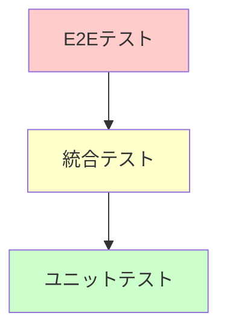

# テスト戦略

## 1. 概要

このドキュメントでは、Tech Blog (astoro-tech-blog) プロジェクトのテスト戦略について説明します。

### 1.1 テストの目的
- コードの品質確保
- リグレッション防止
- リファクタリングの安全性向上
- ドキュメント化の役割

### 1.2 テストレベル
1. **ユニットテスト**: 個別関数・コンポーネントのテスト
2. **統合テスト**: コンポーネント間の連携テスト
3. **E2Eテスト**: エンドユーザー視点でのテスト
4. **アクセシビリティテスト**: ユーザビリティとアクセシビリティ

## 2. テスト方針

### 2.1 テストピラミッド



| レベル | 量 | 速度 | コスト | 信頼性 |
|--------|-----|------|--------|--------|
| E2E | 少 | 遅 | 高 | 最高 |
| 統合 | 中 | 中 | 中 | 高 |
| ユニット | 多 | 速 | 低 | 中 |

### 2.2 テスト対象範囲

#### 2.2.1 重点テスト領域

- [ ] **Reactコンポーネント**: ユーザーインタラクション
- [ ] **Content Collections**: データ取得・変換
- [ ] **ルーティング**: ページナビゲーション
- [ ] **検索機能**: Pagefind統合
- [ ] **テーマ切り替え**: ダークモード機能

#### 2.2.2 テスト対象外

- 外部ライブラリの機能（Astro、React、TailwindCSS）
- ブラウザ標準API
- 静的なMarkdownコンテンツ

### 2.3 品質基準

#### 2.3.1 カバレッジ目標

- **ユニットテスト**: 80%以上
- **統合テスト**: 主要ユーザーフロー100%
- **E2Eテスト**: 重要機能100%

#### 2.3.2 パフォーマンス基準

- **テスト実行時間**: 5分以内
- **CI/CD実行時間**: 10分以内
- **フィードバック速度**: 開発者が待機できる時間

## 3. ユニットテスト

### 3.1 テストツール構成

#### 3.1.1 基本構成

```json
// package.json (予定)
{
  "devDependencies": {
    "vitest": "^1.0.0",
    "@testing-library/react": "^14.0.0",
    "@testing-library/jest-dom": "^6.0.0",
    "@testing-library/user-event": "^14.0.0",
    "jsdom": "^23.0.0"
  },
  "scripts": {
    "test": "vitest",
    "test:coverage": "vitest --coverage",
    "test:ui": "vitest --ui"
  }
}
```

#### 3.1.2 Vitestセットアップ

```typescript
// vitest.config.ts
import { defineConfig } from 'vitest/config';
import react from '@vitejs/plugin-react';

export default defineConfig({
  plugins: [react()],
  test: {
    environment: 'jsdom',
    setupFiles: ['./src/test/setup.ts'],
    globals: true,
  },
});
```

```typescript
// src/test/setup.ts
import '@testing-library/jest-dom';
import { beforeEach } from 'vitest';

// テスト間のクリーンアップ
beforeEach(() => {
  // LocalStorageのクリア
  localStorage.clear();
  // DOMのクリア
  document.body.innerHTML = '';
});
```

### 3.2 Reactコンポーネントテスト

#### 3.2.1 BlogCardコンポーネントのテスト例

```typescript
// src/components/react/__tests__/BlogCard.test.tsx
import { describe, it, expect } from 'vitest';
import { render, screen } from '@testing-library/react';
import BlogCard from '../BlogCard';

const mockPost = {
  slug: 'test-post',
  data: {
    title: 'テスト記事',
    description: 'テスト用の記事です',
    pubDate: new Date('2024-01-15'),
    tags: ['TypeScript', 'テスト'],
    draft: false,
  },
  body: 'テスト記事の本文です。'.repeat(100), // 読了時間計算用
};

describe('BlogCard', () => {
  it('記事情報が正しく表示される', () => {
    render(<BlogCard post={mockPost} />);
    
    expect(screen.getByText('テスト記事')).toBeInTheDocument();
    expect(screen.getByText('テスト用の記事です')).toBeInTheDocument();
    expect(screen.getByText('2024年01月15日')).toBeInTheDocument();
  });

  it('タグが正しく表示される', () => {
    render(<BlogCard post={mockPost} />);
    
    expect(screen.getByText('TypeScript')).toBeInTheDocument();
    expect(screen.getByText('テスト')).toBeInTheDocument();
  });

  it('記事リンクが正しく設定される', () => {
    render(<BlogCard post={mockPost} />);
    
    const link = screen.getByRole('link');
    expect(link).toHaveAttribute('href', '/blog/test-post/');
  });

  it('読了時間が表示される', () => {
    render(<BlogCard post={mockPost} />);
    
    expect(screen.getByText(/分で読めます/)).toBeInTheDocument();
  });
});
```

#### 3.2.2 ThemeToggleコンポーネントのテスト例

```typescript
// src/components/react/__tests__/ThemeToggle.test.tsx
import { describe, it, expect, beforeEach } from 'vitest';
import { render, screen } from '@testing-library/react';
import userEvent from '@testing-library/user-event';
import ThemeToggle from '../ThemeToggle';

describe('ThemeToggle', () => {
  beforeEach(() => {
    // テーマ設定をリセット
    localStorage.removeItem('theme');
    document.documentElement.classList.remove('dark');
  });

  it('初期状態でライトモードが表示される', () => {
    render(<ThemeToggle />);
    
    const button = screen.getByRole('button', { name: /テーマを切り替え/ });
    expect(button).toBeInTheDocument();
    expect(button).toHaveTextContent('🌙');
  });

  it('ボタンクリックでダークモードに切り替わる', async () => {
    const user = userEvent.setup();
    render(<ThemeToggle />);
    
    const button = screen.getByRole('button');
    await user.click(button);
    
    expect(button).toHaveTextContent('☀️');
    expect(document.documentElement).toHaveClass('dark');
    expect(localStorage.getItem('theme')).toBe('dark');
  });

  it('LocalStorageの設定が復元される', () => {
    localStorage.setItem('theme', 'dark');
    document.documentElement.classList.add('dark');
    
    render(<ThemeToggle />);
    
    const button = screen.getByRole('button');
    expect(button).toHaveTextContent('☀️');
  });
});
```

#### 3.2.3 Navigationコンポーネントのテスト例

```typescript
// src/components/react/__tests__/Navigation.test.tsx
import { describe, it, expect } from 'vitest';
import { render, screen } from '@testing-library/react';
import Navigation from '../Navigation';

describe('Navigation', () => {
  const defaultProps = {
    currentPath: '/blog/',
  };

  it('ナビゲーション項目が表示される', () => {
    render(<Navigation {...defaultProps} />);
    
    expect(screen.getByText('ホーム')).toBeInTheDocument();
    expect(screen.getByText('ブログ')).toBeInTheDocument();
    expect(screen.getByText('About')).toBeInTheDocument();
  });

  it('現在のページがハイライトされる', () => {
    render(<Navigation {...defaultProps} />);
    
    const blogLink = screen.getByText('ブログ').closest('a');
    expect(blogLink).toHaveAttribute('aria-current', 'page');
  });

  it('モバイル表示で縦型レイアウトになる', () => {
    render(<Navigation {...defaultProps} mobile />);
    
    const nav = screen.getByRole('navigation');
    expect(nav).toHaveClass('flex-col');
  });
});
```

### 3.3 ユーティリティ関数テスト

#### 3.3.1 日付フォーマット関数のテスト

```typescript
// src/utils/__tests__/date.test.ts
import { describe, it, expect } from 'vitest';
import { formatDate, formatDateISO, isDateAfter } from '../date';

describe('date utilities', () => {
  const testDate = new Date('2024-01-15T10:30:00Z');

  describe('formatDate', () => {
    it('デフォルトフォーマットで日付を返す', () => {
      const result = formatDate(testDate);
      expect(result).toBe('2024年01月15日');
    });

    it('カスタムフォーマットで日付を返す', () => {
      const result = formatDate(testDate, 'yyyy/MM/dd');
      expect(result).toBe('2024/01/15');
    });
  });

  describe('formatDateISO', () => {
    it('ISO形式で日付を返す', () => {
      const result = formatDateISO(testDate);
      expect(result).toBe('2024-01-15');
    });
  });

  describe('isDateAfter', () => {
    it('後の日付でtrueを返す', () => {
      const laterDate = new Date('2024-01-16');
      expect(isDateAfter(laterDate, testDate)).toBe(true);
    });

    it('前の日付でfalseを返す', () => {
      const earlierDate = new Date('2024-01-14');
      expect(isDateAfter(earlierDate, testDate)).toBe(false);
    });
  });
});
```

#### 3.3.2 タグ操作関数のテスト

```typescript
// src/utils/__tests__/tags.test.ts
import { describe, it, expect } from 'vitest';
import { getAllTags, getPostsByTag, getTagCounts } from '../tags';

const mockPosts = [
  {
    slug: 'post-1',
    data: { tags: ['TypeScript', 'React'] },
  },
  {
    slug: 'post-2', 
    data: { tags: ['JavaScript', 'TypeScript'] },
  },
  {
    slug: 'post-3',
    data: { tags: ['React', 'CSS'] },
  },
];

describe('tag utilities', () => {
  describe('getAllTags', () => {
    it('重複を除いたタグ一覧を返す', () => {
      const result = getAllTags(mockPosts);
      expect(result).toEqual(['CSS', 'JavaScript', 'React', 'TypeScript']);
    });
  });

  describe('getPostsByTag', () => {
    it('指定タグの記事を返す', () => {
      const result = getPostsByTag(mockPosts, 'React');
      expect(result).toHaveLength(2);
      expect(result[0].slug).toBe('post-1');
      expect(result[1].slug).toBe('post-3');
    });
  });

  describe('getTagCounts', () => {
    it('タグごとの記事数を返す', () => {
      const result = getTagCounts(mockPosts);
      expect(result).toEqual({
        TypeScript: 2,
        React: 2,
        JavaScript: 1,
        CSS: 1,
      });
    });
  });
});
```

## 4. 統合テスト

### 4.1 ページレンダリングテスト

#### 4.1.1 ブログ一覧ページのテスト

```typescript
// src/pages/__tests__/blog.test.ts
import { describe, it, expect } from 'vitest';
import { experimental_AstroContainer as AstroContainer } from 'astro/container';
import BlogIndex from '../blog/index.astro';

describe('Blog Index Page', () => {
  it('ブログ一覧が正しくレンダリングされる', async () => {
    const container = await AstroContainer.create();
    const result = await container.renderToString(BlogIndex);
    
    expect(result).toContain('ブログ記事一覧');
    expect(result).toContain('記事が見つかりません');
  });
});
```

### 4.2 Content Collections統合テスト

#### 4.2.1 記事データ取得テスト

```typescript
// src/content/__tests__/blog.test.ts
import { describe, it, expect } from 'vitest';
import { getCollection } from 'astro:content';

describe('Blog Content Collections', () => {
  it('公開記事のみ取得される', async () => {
    const posts = await getCollection('blog', ({ data }) => {
      return data.draft !== true;
    });
    
    posts.forEach(post => {
      expect(post.data.draft).not.toBe(true);
    });
  });

  it('記事データの型が正しい', async () => {
    const posts = await getCollection('blog');
    
    if (posts.length > 0) {
      const post = posts[0];
      expect(typeof post.data.title).toBe('string');
      expect(typeof post.data.description).toBe('string');
      expect(post.data.pubDate).toBeInstanceOf(Date);
      expect(Array.isArray(post.data.tags)).toBe(true);
    }
  });
});
```

## 5. E2Eテスト

### 5.1 Playwrightセットアップ

#### 5.1.1 設定ファイル

```typescript
// playwright.config.ts
import { defineConfig, devices } from '@playwright/test';

export default defineConfig({
  testDir: './e2e',
  fullyParallel: true,
  forbidOnly: !!process.env.CI,
  retries: process.env.CI ? 2 : 0,
  workers: process.env.CI ? 1 : undefined,
  reporter: 'html',
  use: {
    baseURL: 'http://localhost:4321',
    trace: 'on-first-retry',
  },
  projects: [
    {
      name: 'chromium',
      use: { ...devices['Desktop Chrome'] },
    },
    {
      name: 'firefox',
      use: { ...devices['Desktop Firefox'] },
    },
    {
      name: 'webkit',
      use: { ...devices['Desktop Safari'] },
    },
    {
      name: 'Mobile Chrome',
      use: { ...devices['Pixel 5'] },
    },
  ],
  webServer: {
    command: 'npm run dev',
    port: 4321,
    reuseExistingServer: !process.env.CI,
  },
});
```

### 5.2 E2Eテストシナリオ

#### 5.2.1 基本ナビゲーションテスト

```typescript
// e2e/navigation.spec.ts
import { test, expect } from '@playwright/test';

test.describe('ナビゲーション', () => {
  test('メインナビゲーションが動作する', async ({ page }) => {
    await page.goto('/');
    
    // ホームページの表示確認
    await expect(page.locator('h1')).toContainText('Tech Blog');
    
    // ブログ一覧へのナビゲーション
    await page.click('text=ブログ');
    await expect(page).toHaveURL('/blog/');
    await expect(page.locator('h1')).toContainText('ブログ記事一覧');
    
    // Aboutページへのナビゲーション
    await page.click('text=About');
    await expect(page).toHaveURL('/about/');
    
    // ホームに戻る
    await page.click('text=ホーム');
    await expect(page).toHaveURL('/');
  });

  test('モバイルメニューが動作する', async ({ page }) => {
    await page.setViewportSize({ width: 375, height: 667 });
    await page.goto('/');
    
    // ハンバーガーメニューをクリック
    await page.click('[aria-label="メニューを開く"]');
    
    // モバイルメニューが表示される
    await expect(page.locator('[role="dialog"]')).toBeVisible();
    
    // メニュー項目をクリック
    await page.click('text=ブログ');
    await expect(page).toHaveURL('/blog/');
    
    // メニューが自動で閉じる
    await expect(page.locator('[role="dialog"]')).not.toBeVisible();
  });
});
```

#### 5.2.2 ブログ機能テスト

```typescript
// e2e/blog.spec.ts
import { test, expect } from '@playwright/test';

test.describe('ブログ機能', () => {
  test('ブログ記事一覧が表示される', async ({ page }) => {
    await page.goto('/blog/');
    
    // 記事カードが表示される
    await expect(page.locator('[data-testid="blog-card"]')).toHaveCount(3);
    
    // 記事タイトルが表示される
    await expect(page.locator('h2')).toHaveCount(3);
    
    // タグが表示される
    await expect(page.locator('[data-testid="tag"]')).toHaveCountGreaterThan(0);
  });

  test('記事詳細ページが表示される', async ({ page }) => {
    await page.goto('/blog/');
    
    // 最初の記事をクリック
    await page.click('[data-testid="blog-card"]:first-child a');
    
    // 記事ページに遷移
    await expect(page).toHaveURL(/\/blog\/.*\//);
    
    // 記事コンテンツが表示される
    await expect(page.locator('article')).toBeVisible();
    await expect(page.locator('h1')).toBeVisible();
    
    // 目次が表示される
    await expect(page.locator('[data-testid="toc"]')).toBeVisible();
  });

  test('タグページが動作する', async ({ page }) => {
    await page.goto('/tags/');
    
    // タグ一覧が表示される
    await expect(page.locator('[data-testid="tag-list"]')).toBeVisible();
    
    // タグをクリック
    await page.click('[data-testid="tag-link"]:first-child');
    
    // タグ別記事一覧ページに遷移
    await expect(page).toHaveURL(/\/tags\/.*\//);
    
    // フィルタリングされた記事が表示される
    await expect(page.locator('[data-testid="blog-card"]')).toHaveCountGreaterThan(0);
  });
});
```

#### 5.2.3 検索機能テスト

```typescript
// e2e/search.spec.ts
import { test, expect } from '@playwright/test';

test.describe('検索機能', () => {
  test('記事検索が動作する', async ({ page }) => {
    await page.goto('/');
    
    // 検索ボックスに入力
    await page.fill('[data-testid="search-input"]', 'TypeScript');
    
    // 検索結果が表示される
    await expect(page.locator('[data-testid="search-results"]')).toBeVisible();
    
    // 検索結果をクリック
    await page.click('[data-testid="search-result"]:first-child');
    
    // 該当記事ページに遷移
    await expect(page).toHaveURL(/\/blog\/.*\//);
  });

  test('検索結果のハイライトが動作する', async ({ page }) => {
    await page.goto('/');
    
    await page.fill('[data-testid="search-input"]', 'React');
    
    // ハイライトされたテキストが表示される
    await expect(page.locator('[data-testid="search-highlight"]')).toBeVisible();
  });
});
```

#### 5.2.4 テーマ切り替えテスト

```typescript
// e2e/theme.spec.ts
import { test, expect } from '@playwright/test';

test.describe('テーマ切り替え', () => {
  test('ダークモード切り替えが動作する', async ({ page }) => {
    await page.goto('/');
    
    // 初期状態（ライトモード）
    await expect(page.locator('html')).not.toHaveClass('dark');
    
    // テーマ切り替えボタンをクリック
    await page.click('[data-testid="theme-toggle"]');
    
    // ダークモードに変更される
    await expect(page.locator('html')).toHaveClass('dark');
    
    // 再度クリックでライトモードに戻る
    await page.click('[data-testid="theme-toggle"]');
    await expect(page.locator('html')).not.toHaveClass('dark');
  });

  test('テーマ設定が永続化される', async ({ page }) => {
    await page.goto('/');
    
    // ダークモードに切り替え
    await page.click('[data-testid="theme-toggle"]');
    await expect(page.locator('html')).toHaveClass('dark');
    
    // ページをリロード
    await page.reload();
    
    // ダークモードが維持される
    await expect(page.locator('html')).toHaveClass('dark');
  });
});
```

## 6. アクセシビリティテスト

### 6.1 axe-core統合

#### 6.1.1 セットアップ

```typescript
// e2e/accessibility.spec.ts
import { test, expect } from '@playwright/test';
import AxeBuilder from '@axe-core/playwright';

test.describe('アクセシビリティ', () => {
  test('ホームページがWCAG準拠している', async ({ page }) => {
    await page.goto('/');
    
    const accessibilityScanResults = await new AxeBuilder({ page }).analyze();
    
    expect(accessibilityScanResults.violations).toEqual([]);
  });

  test('ブログページがWCAG準拠している', async ({ page }) => {
    await page.goto('/blog/');
    
    const accessibilityScanResults = await new AxeBuilder({ page }).analyze();
    
    expect(accessibilityScanResults.violations).toEqual([]);
  });
});
```

### 6.2 キーボードナビゲーションテスト

```typescript
// e2e/keyboard-navigation.spec.ts
import { test, expect } from '@playwright/test';

test.describe('キーボードナビゲーション', () => {
  test('Tabキーでのナビゲーション', async ({ page }) => {
    await page.goto('/');
    
    // 最初の要素にフォーカス
    await page.keyboard.press('Tab');
    
    // フォーカス可能な要素を順次確認
    const focusableElements = [
      'header a[href="/"]', // ロゴリンク
      'nav a[href="/"]',    // ホームリンク
      'nav a[href="/blog/"]', // ブログリンク
      '[data-testid="theme-toggle"]', // テーマ切り替え
      '[data-testid="search-input"]', // 検索ボックス
    ];
    
    for (const selector of focusableElements) {
      await expect(page.locator(selector)).toBeFocused();
      await page.keyboard.press('Tab');
    }
  });

  test('Enterキーでのアクション実行', async ({ page }) => {
    await page.goto('/');
    
    // テーマ切り替えボタンにフォーカス
    await page.focus('[data-testid="theme-toggle"]');
    
    // Enterキーでアクション実行
    await page.keyboard.press('Enter');
    
    // ダークモードに切り替わる
    await expect(page.locator('html')).toHaveClass('dark');
  });
});
```

### 6.3 スクリーンリーダー対応テスト

```typescript
// e2e/screen-reader.spec.ts
import { test, expect } from '@playwright/test';

test.describe('スクリーンリーダー対応', () => {
  test('適切なARIA属性が設定されている', async ({ page }) => {
    await page.goto('/');
    
    // メインナビゲーション
    await expect(page.locator('nav')).toHaveAttribute('aria-label', 'メインナビゲーション');
    
    // 検索ボックス
    await expect(page.locator('[data-testid="search-input"]')).toHaveAttribute('aria-label', '記事を検索');
    
    // テーマ切り替えボタン
    await expect(page.locator('[data-testid="theme-toggle"]')).toHaveAttribute('aria-label', 'テーマを切り替え');
  });

  test('見出し構造が適切', async ({ page }) => {
    await page.goto('/blog/first-post/');
    
    // H1が1つだけ存在
    await expect(page.locator('h1')).toHaveCount(1);
    
    // 見出しの階層が適切
    const headings = await page.locator('h1, h2, h3, h4, h5, h6').all();
    
    for (let i = 0; i < headings.length - 1; i++) {
      const currentLevel = parseInt((await headings[i].getAttribute('tagName')).charAt(1));
      const nextLevel = parseInt((await headings[i + 1].getAttribute('tagName')).charAt(1));
      
      // 見出しレベルのスキップがない
      expect(nextLevel - currentLevel).toBeLessThanOrEqual(1);
    }
  });
});
```

## 7. パフォーマンステスト

### 7.1 Lighthouseテスト

```typescript
// e2e/performance.spec.ts
import { test, expect } from '@playwright/test';
import lighthouse from 'lighthouse';
import { launch } from 'chrome-launcher';

test.describe('パフォーマンス', () => {
  test('Lighthouse スコアが基準を満たす', async () => {
    const chrome = await launch({ chromeFlags: ['--headless'] });
    
    const results = await lighthouse('http://localhost:4321', {
      port: chrome.port,
      onlyCategories: ['performance', 'accessibility', 'best-practices', 'seo'],
    });
    
    const scores = results.lhr.categories;
    
    // パフォーマンススコア 90以上
    expect(scores.performance.score).toBeGreaterThanOrEqual(0.9);
    
    // アクセシビリティスコア 95以上
    expect(scores.accessibility.score).toBeGreaterThanOrEqual(0.95);
    
    // ベストプラクティススコア 90以上
    expect(scores['best-practices'].score).toBeGreaterThanOrEqual(0.9);
    
    // SEOスコア 95以上
    expect(scores.seo.score).toBeGreaterThanOrEqual(0.95);
    
    await chrome.kill();
  });
});
```

### 7.2 Core Web Vitalsテスト

```typescript
// e2e/core-web-vitals.spec.ts
import { test, expect } from '@playwright/test';

test.describe('Core Web Vitals', () => {
  test('LCPが2.5秒以内', async ({ page }) => {
    await page.goto('/');
    
    const lcp = await page.evaluate(() => {
      return new Promise((resolve) => {
        new PerformanceObserver((list) => {
          const entries = list.getEntries();
          const lastEntry = entries[entries.length - 1];
          resolve(lastEntry.startTime);
        }).observe({ entryTypes: ['largest-contentful-paint'] });
      });
    });
    
    expect(lcp).toBeLessThan(2500);
  });

  test('CLSが0.1以下', async ({ page }) => {
    await page.goto('/');
    
    // ページの読み込み完了を待つ
    await page.waitForLoadState('networkidle');
    
    const cls = await page.evaluate(() => {
      return new Promise((resolve) => {
        let clsValue = 0;
        new PerformanceObserver((list) => {
          for (const entry of list.getEntries()) {
            if (!entry.hadRecentInput) {
              clsValue += entry.value;
            }
          }
          resolve(clsValue);
        }).observe({ entryTypes: ['layout-shift'] });
        
        // 5秒後に値を返す
        setTimeout(() => resolve(clsValue), 5000);
      });
    });
    
    expect(cls).toBeLessThan(0.1);
  });
});
```

## 8. CI/CD統合

### 8.1 GitHub Actions設定

```yaml
# .github/workflows/test.yml
name: Test

on:
  push:
    branches: [ main, develop ]
  pull_request:
    branches: [ main, develop ]

jobs:
  unit-test:
    runs-on: ubuntu-latest
    steps:
      - uses: actions/checkout@v4
      
      - name: Setup Node.js
        uses: actions/setup-node@v4
        with:
          node-version: '18'
          cache: 'npm'
      
      - name: Install dependencies
        run: npm ci
      
      - name: Run unit tests
        run: npm run test:coverage
      
      - name: Upload coverage reports
        uses: codecov/codecov-action@v3

  e2e-test:
    runs-on: ubuntu-latest
    steps:
      - uses: actions/checkout@v4
      
      - name: Setup Node.js
        uses: actions/setup-node@v4
        with:
          node-version: '18'
          cache: 'npm'
      
      - name: Install dependencies
        run: npm ci
      
      - name: Install Playwright
        run: npx playwright install --with-deps
      
      - name: Build application
        run: npm run build
      
      - name: Run E2E tests
        run: npx playwright test
      
      - name: Upload test results
        uses: actions/upload-artifact@v3
        if: always()
        with:
          name: playwright-report
          path: playwright-report/
```

### 8.2 品質ゲート

```yaml
# .github/workflows/quality-gate.yml
name: Quality Gate

on:
  pull_request:
    branches: [ main ]

jobs:
  quality-gate:
    runs-on: ubuntu-latest
    steps:
      - uses: actions/checkout@v4
      
      - name: Setup Node.js
        uses: actions/setup-node@v4
        with:
          node-version: '18'
          cache: 'npm'
      
      - name: Install dependencies
        run: npm ci
      
      - name: Lint check
        run: npm run lint
      
      - name: Format check
        run: npm run format:check
      
      - name: Type check
        run: npx tsc --noEmit
      
      - name: Unit tests with coverage
        run: npm run test:coverage
      
      - name: Coverage threshold check
        run: |
          COVERAGE=$(npm run test:coverage -- --reporter=json | jq '.coverage.total.lines.pct')
          if (( $(echo "$COVERAGE < 80" | bc -l) )); then
            echo "Coverage $COVERAGE% is below threshold 80%"
            exit 1
          fi
      
      - name: Build check
        run: npm run build
```

## 9. テスト実行・レポート

### 9.1 ローカル実行

```bash
# 全テスト実行
npm run test

# カバレッジ付きテスト
npm run test:coverage

# E2Eテスト
npx playwright test

# 特定のテストファイル
npm run test BlogCard.test.tsx

# ウォッチモード
npm run test -- --watch
```

### 9.2 レポート生成

```bash
# HTMLレポート生成
npm run test:coverage -- --reporter=html

# Playwrightレポート
npx playwright show-report

# JSON形式レポート
npm run test:coverage -- --reporter=json > coverage-report.json
```

## 10. テストメンテナンス

### 10.1 定期的な見直し

- **月次**: テストケースの追加・削除
- **四半期**: テスト戦略の見直し
- **年次**: テストツール・フレームワークの更新

### 10.2 テスト品質向上

- テストの可読性向上
- テストの実行速度改善
- フレイキーテストの修正
- テストカバレッジの改善

---

**文書作成日**: 2025-01-15  
**作成者**: Claude Code  
**バージョン**: 1.0  
**関連文書**: 07-development-guide.md, 06-maintenance-guide.md