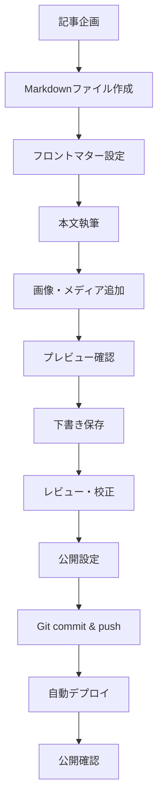

# 保守運用ガイド

## 1. 概要

このドキュメントでは、Tech Blog (astoro-tech-blog) プロジェクトの日常的な保守運用について説明します。

### 1.1 保守運用の範囲
- コンテンツ管理・更新
- パフォーマンス監視・最適化
- セキュリティ対策
- バックアップ・復旧
- トラブルシューティング

### 1.2 責任範囲
- **コンテンツ管理者**: 記事投稿、編集、削除
- **システム管理者**: サーバー管理、セキュリティ、パフォーマンス
- **開発者**: 機能追加、バグ修正、技術的改善

## 2. コンテンツ管理

### 2.1 記事投稿フロー

#### 2.1.1 基本的な記事投稿手順



#### 2.1.2 記事ファイル作成

```bash
# 新しい記事ファイルの作成
cd src/content/blog/
touch new-article-slug.md
```

#### 2.1.3 フロントマター設定例

```yaml
---
title: '記事タイトル'
description: '記事の概要説明（160文字以内推奨）'
pubDate: 2024-01-15
updatedDate: 2024-01-20  # 更新時のみ
heroImage: 'https://example.com/hero.jpg'  # 任意
tags: ['TypeScript', 'React', 'Astro']
category: '技術'  # 任意
draft: false  # true: 下書き、false: 公開
---
```

#### 2.1.4 記事本文のベストプラクティス

```markdown
# 記事タイトル（H1は自動生成されるため不要）

## 概要

記事の概要を簡潔に説明します。

## 詳細内容

### サブセクション

具体的な内容を記述します。

\`\`\`typescript
// コードブロックの例
const example = 'Hello, World!';
\`\`\`

### 画像の挿入


### リンクの挿入

[リンクテキスト](https://example.com)

## まとめ

記事の要点をまとめます。
```

### 2.2 画像・メディア管理

#### 2.2.1 画像保存場所

```
public/
├── images/
│   ├── blog/
│   │   ├── 2024/
│   │   │   ├── 01/
│   │   │   │   ├── article-slug/
│   │   │   │   │   ├── hero.jpg
│   │   │   │   │   ├── screenshot1.png
│   │   │   │   │   └── diagram.svg
```

#### 2.2.2 画像最適化ガイドライン

- **ヒーロー画像**: 1200x630px（OGP対応）
- **本文画像**: 幅800px以内
- **ファイル形式**: WebP > JPEG > PNG
- **ファイルサイズ**: 100KB以下推奨

#### 2.2.3 画像最適化コマンド

```bash
# ImageMagickを使用した最適化例
convert input.jpg -quality 85 -resize 800x output.jpg

# WebP変換
cwebp input.jpg -q 85 -o output.webp
```

### 2.3 記事更新・編集

#### 2.3.1 既存記事の更新

1. **ファイル編集**
   ```bash
   # 既存記事の編集
   code src/content/blog/existing-article.md
   ```

2. **更新日の設定**
   ```yaml
   ---
   title: '既存記事タイトル'
   updatedDate: 2024-01-20  # 更新日を追加・変更
   ---
   ```

3. **変更内容の確認**
   ```bash
   npm run dev
   # http://localhost:4321 で確認
   ```

#### 2.3.2 記事削除

1. **ファイル削除**
   ```bash
   rm src/content/blog/article-to-delete.md
   ```

2. **関連画像の削除**
   ```bash
   rm -rf public/images/blog/article-to-delete/
   ```

3. **リンク確認**
   - 他の記事からのリンクがないか確認
   - 必要に応じてリダイレクト設定

### 2.4 下書き管理

#### 2.4.1 下書きの作成

```yaml
---
title: '下書き記事'
description: 'まだ公開しない記事'
pubDate: 2024-01-15
draft: true  # 下書きモード
tags: ['draft']
---
```

#### 2.4.2 下書きの確認

```bash
# 開発環境では下書きも表示される
npm run dev

# 本番ビルドでは下書きは除外される
npm run build
```

## 3. パフォーマンス監視・最適化

### 3.1 パフォーマンス指標

#### 3.1.1 Core Web Vitals

- **LCP (Largest Contentful Paint)**: 2.5秒以下
- **FID (First Input Delay)**: 100ms以下
- **CLS (Cumulative Layout Shift)**: 0.1以下

#### 3.1.2 その他の指標

- **TTFB (Time to First Byte)**: 600ms以下
- **Speed Index**: 3.4秒以下
- **Total Blocking Time**: 200ms以下

### 3.2 パフォーマンス計測ツール

#### 3.2.1 Lighthouse

```bash
# Lighthouse CLI
npm install -g lighthouse
lighthouse https://yourdomain.com --output html --output-path ./report.html
```

#### 3.2.2 PageSpeed Insights

- [PageSpeed Insights](https://pagespeed.web.dev/)
- モバイル・デスクトップ両方で計測
- 定期的な監視推奨

#### 3.2.3 WebPageTest

- [WebPageTest](https://www.webpagetest.org/)
- 詳細なウォーターフォール分析
- 様々な環境での計測

### 3.3 パフォーマンス最適化

#### 3.3.1 画像最適化

```astro
---
// Astro画像最適化
import { Image } from 'astro:assets';
import heroImage from '../assets/hero.jpg';
---

<Image 
  src={heroImage} 
  alt="説明文" 
  width={800} 
  height={400}
  loading="lazy"
  format="webp"
/>
```

#### 3.3.2 フォント最適化

```html
<!-- フォントプリロード -->
<link rel="preconnect" href="https://fonts.googleapis.com">
<link rel="preconnect" href="https://fonts.gstatic.com" crossorigin>
<link rel="preload" href="/fonts/inter-var.woff2" as="font" type="font/woff2" crossorigin>
```

#### 3.3.3 JavaScript最適化

```typescript
// 遅延ローディング
<BlogCard client:visible />

// 必要時のみロード
<ThemeToggle client:load />

// 静的レンダリング（JSなし）
<Footer />
```

### 3.4 定期的なメンテナンス

#### 3.4.1 依存関係の更新

```bash
# 週次実行推奨
npm outdated
npm update

# セキュリティ脆弱性チェック
npm audit
npm audit fix
```

#### 3.4.2 キャッシュクリア

```bash
# Astroキャッシュクリア
rm -rf .astro/
rm -rf dist/

# 再ビルド
npm run build
```

## 4. セキュリティ対策

### 4.1 基本的なセキュリティ設定

#### 4.1.1 セキュリティヘッダー

```
Content-Security-Policy: default-src 'self'; script-src 'self' 'unsafe-inline'; style-src 'self' 'unsafe-inline' fonts.googleapis.com; font-src fonts.gstatic.com;
X-Frame-Options: DENY
X-Content-Type-Options: nosniff
X-XSS-Protection: 1; mode=block
Strict-Transport-Security: max-age=31536000; includeSubDomains
Referrer-Policy: strict-origin-when-cross-origin
```

#### 4.1.2 依存関係のセキュリティ

```bash
# 定期的なセキュリティ監査
npm audit

# 脆弱性の自動修正
npm audit fix

# 高リスク脆弱性の手動対応
npm audit fix --force
```

### 4.2 コンテンツセキュリティ

#### 4.2.1 不正コンテンツの防止

- XSS攻撃の防止（Astroの自動エスケープ）
- 外部リンクの安全性確認
- 画像・メディアファイルの検証

#### 4.2.2 アクセス制御

```yaml
# 下書き記事のアクセス制御
draft: true  # 本番環境では非表示
```

### 4.3 バックアップ戦略

#### 4.3.1 バックアップ対象

- [ ] ソースコード（Git管理）
- [ ] コンテンツファイル
- [ ] 設定ファイル
- [ ] 画像・メディアファイル

#### 4.3.2 バックアップ頻度

- **自動バックアップ**: Git pushでの自動保存
- **手動バックアップ**: 月次でのアーカイブ作成
- **画像バックアップ**: クラウドストレージとの同期

## 5. トラブルシューティング

### 5.1 よくある問題と解決方法

#### 5.1.1 ビルドエラー

**問題**: `npm run build`でエラーが発生

```bash
# 解決方法
rm -rf node_modules package-lock.json
npm install
npm run build
```

**問題**: TypeScriptエラー

```bash
# 型チェック実行
npx tsc --noEmit

# 詳細エラー確認
npm run check
```

#### 5.1.2 検索機能の問題

**問題**: 検索結果が表示されない

- Pagefindインデックスの再生成
- `data-pagefind-body`属性の確認
- JavaScript読み込みエラーの確認

#### 5.1.3 パフォーマンス問題

**問題**: ページ読み込みが遅い

- 画像サイズの確認・最適化
- 不要なJavaScriptの除去
- CDNキャッシュの確認

### 5.2 エラーログの確認

#### 5.2.1 開発環境

```bash
# 詳細ログでの開発サーバー起動
npm run dev -- --verbose

# ビルドログの確認
npm run build -- --verbose
```

#### 5.2.2 本番環境

- ホスティングサービスのログ確認
- ブラウザDevToolsでのエラー確認
- ネットワークエラーの調査

### 5.3 緊急時対応

#### 5.3.1 サイトダウン時

1. **状況確認**
   - サイトアクセス確認
   - DNS解決確認
   - ホスティングサービス状況確認

2. **復旧手順**
   - 前回正常バージョンへのロールバック
   - 緊急修正とデプロイ
   - 正常動作確認

3. **事後対応**
   - 原因調査と報告
   - 再発防止策の検討
   - ドキュメント更新

## 6. 定期作業チェックリスト

### 6.1 日次作業

- [ ] サイト正常動作確認
- [ ] エラーログ確認
- [ ] アクセス解析確認（Google Analytics等）

### 6.2 週次作業

- [ ] 依存関係の更新確認
- [ ] セキュリティ脆弱性チェック
- [ ] パフォーマンス指標確認
- [ ] バックアップ確認

### 6.3 月次作業

- [ ] Core Web Vitals計測
- [ ] 総合的なパフォーマンステスト
- [ ] アクセシビリティチェック
- [ ] SEO指標確認

### 6.4 四半期作業

- [ ] 大規模な依存関係更新
- [ ] 機能追加・改善の検討
- [ ] セキュリティ監査
- [ ] 災害復旧テスト

## 7. 監視・アラート設定

### 7.1 推奨監視ツール

#### 7.1.1 稼働監視

- **UptimeRobot**: サイト稼働監視
- **Pingdom**: パフォーマンス監視
- **StatusCake**: 多地点監視

#### 7.1.2 パフォーマンス監視

- **Google PageSpeed Insights API**: 自動計測
- **Lighthouse CI**: CI/CDでの自動計測
- **WebPageTest API**: 詳細分析

#### 7.1.3 エラー監視

- **Sentry**: エラートラッキング
- **LogRocket**: ユーザーセッション記録
- **Bugsnag**: エラー通知

### 7.2 アラート設定

```yaml
# 監視設定例
uptime_monitoring:
  check_interval: 5分
  alert_threshold: 3回連続失敗
  notification: email, Slack

performance_monitoring:
  check_interval: 1時間
  alert_threshold: 
    - LCP > 4秒
    - FID > 300ms
    - CLS > 0.25
```

## 8. ドキュメント管理

### 8.1 ドキュメント更新

- 機能追加・変更時のドキュメント更新
- 手順書の定期見直し
- トラブル事例の蓄積

### 8.2 ナレッジ管理

- よくある質問（FAQ）の整備
- トラブルシューティング事例集
- ベストプラクティス集

---

**文書作成日**: 2025-01-15  
**作成者**: Claude Code  
**バージョン**: 1.0  
**関連文書**: 05-deployment-guide.md, 07-development-guide.md